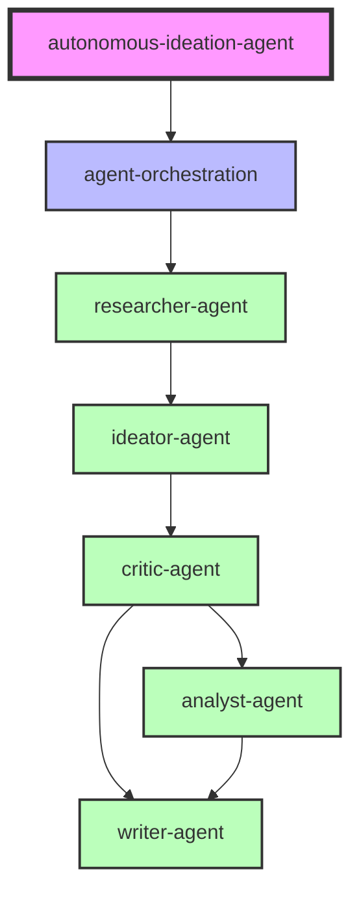

# エージェント仕様書管理

## 📋 仕様書一覧と実装状況

| エージェント | フェーズ | 実装状況 | 依存関係 | 主要機能 |
|------------|---------|---------|---------|---------|
| **autonomous-ideation-agent** | tasks-generated | ⏳ 承認待ち | - | システム全体統括 |
| **researcher-agent** | tasks-generated | ✅ 実装完了 | Serper API | 市場調査・情報収集 |
| **ideator-agent** | tasks-generated | ✅ 実装完了 | researcher-agent | アイデア生成 |
| **critic-agent** | tasks-generated | ✅ 実装完了 | ideator-agent | アイデア評価 |
| **analyst-agent** | tasks-generated | ✅ 実装完了 | critic-agent | 詳細分析 |
| **writer-agent** | tasks-generated | ✅ 実装完了 | analyst-agent | レポート作成 |
| **agent-orchestration** | tasks-generated | ✅ 実装完了 | 全エージェント | ワークフロー管理 |

## 🔄 エージェント依存関係マップ



## 📂 ディレクトリ構造

```
.kiro/specs/
├── README.md                          # このファイル
├── autonomous-ideation-agent/         # システム全体仕様
│   ├── spec.json                     # 仕様メタデータ
│   ├── requirements.md               # 要件定義
│   ├── design.md                     # 設計書
│   └── tasks.md                      # タスクリスト
├── researcher-agent/                  # 調査エージェント
│   ├── spec.json ✅
│   ├── requirements.md
│   ├── design.md
│   └── tasks.md
├── ideator-agent/                     # アイデア生成エージェント
│   ├── spec.json ✅
│   ├── requirements.md
│   ├── design.md
│   └── tasks.md
├── critic-agent/                      # 評価エージェント
│   ├── spec.json ✅
│   ├── requirements.md
│   ├── design.md
│   └── tasks.md
├── analyst-agent/                     # 分析エージェント
│   ├── spec.json ✅
│   ├── requirements.md
│   ├── design.md
│   └── tasks.md
├── writer-agent/                      # ライターエージェント
│   ├── spec.json ✅
│   ├── requirements.md
│   ├── design.md
│   └── tasks.md
└── agent-orchestration/               # オーケストレーション
    ├── spec.json ✅
    ├── requirements.md
    ├── design.md
    └── tasks.md
```

## 🚀 仕様書の使い方

### 1. 新規エージェント追加時

```bash
# 仕様書初期化
/kiro:spec-init "新規エージェントの詳細説明"

# 要件定義生成
/kiro:spec-requirements [agent-name]

# 設計書生成
/kiro:spec-design [agent-name]

# タスク生成
/kiro:spec-tasks [agent-name]
```

### 2. 実装状況確認

```bash
# 特定エージェントの状況確認
/kiro:spec-status [agent-name]

# 全エージェントの状況確認
for dir in .kiro/specs/*/; do
  echo "=== $(basename $dir) ==="
  cat "$dir/spec.json" | jq '.ready_for_implementation'
done
```

### 3. 仕様書更新

```bash
# spec.jsonの実装状況更新
cd .kiro/specs/[agent-name]
# spec.jsonを編集して以下を更新：
# - "ready_for_implementation": true
# - "approvals.tasks.approved": true
```

## 📊 実装進捗管理

### 完了基準チェックリスト

#### エージェント実装完了の条件
- [ ] lib/agents/[agent-name]/index.ts が存在
- [ ] 単体テストがパス
- [ ] APIエンドポイントが動作
- [ ] ドキュメントが完成
- [ ] spec.json が更新済み

### 実装優先順位

1. **Phase 1: 基盤** ✅ 完了
   - researcher-agent
   - agent-orchestration

2. **Phase 2: コア機能** ✅ 完了
   - ideator-agent
   - critic-agent

3. **Phase 3: 拡張機能** ✅ 完了
   - analyst-agent
   - writer-agent

4. **Phase 4: 統合** ⏳ 進行中
   - autonomous-ideation-agent（全体統括）

## 🔧 仕様書フォーマット

### spec.json の構造

```json
{
  "feature_name": "エージェント名",
  "project_description": "詳細説明",
  "created_at": "作成日時",
  "updated_at": "更新日時",
  "language": "japanese",
  "phase": "現在のフェーズ",
  "approvals": {
    "requirements": {
      "generated": true/false,
      "approved": true/false
    },
    "design": {
      "generated": true/false,
      "approved": true/false
    },
    "tasks": {
      "generated": true/false,
      "approved": true/false
    }
  },
  "ready_for_implementation": true/false
}
```

### フェーズの説明

- **initialized**: 初期化済み
- **requirements-generated**: 要件定義生成済み
- **requirements-approved**: 要件定義承認済み
- **design-generated**: 設計書生成済み
- **design-approved**: 設計書承認済み
- **tasks-generated**: タスク生成済み
- **tasks-approved**: タスク承認済み（実装可能）

## 📝 メンテナンス

### 定期更新タスク

1. **週次**: 実装状況の確認と spec.json 更新
2. **月次**: 依存関係の見直しと最適化
3. **四半期**: 全体アーキテクチャのレビュー

### 仕様書の品質基準

- **完全性**: すべての機能が記載されている
- **一貫性**: フォーマットが統一されている
- **追跡可能性**: 実装との対応が明確
- **保守性**: 更新が容易な構造

## 🤝 コントリビューション

仕様書の改善提案は以下の手順で：

1. Issue作成（改善内容を明記）
2. 仕様書を更新
3. Pull Request作成
4. レビューと承認
5. マージ

---

最終更新: 2025-01-17
管理者: プロジェクトチーム