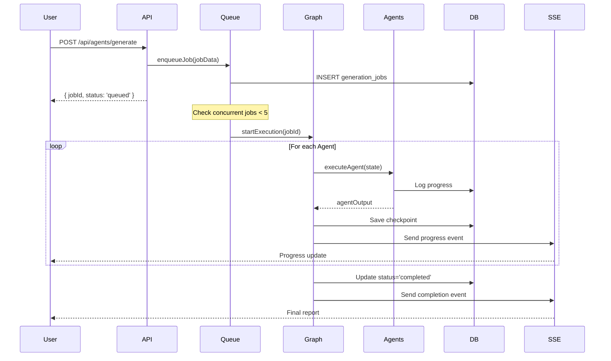
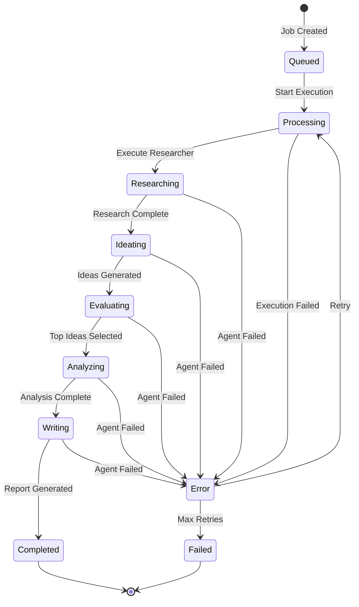
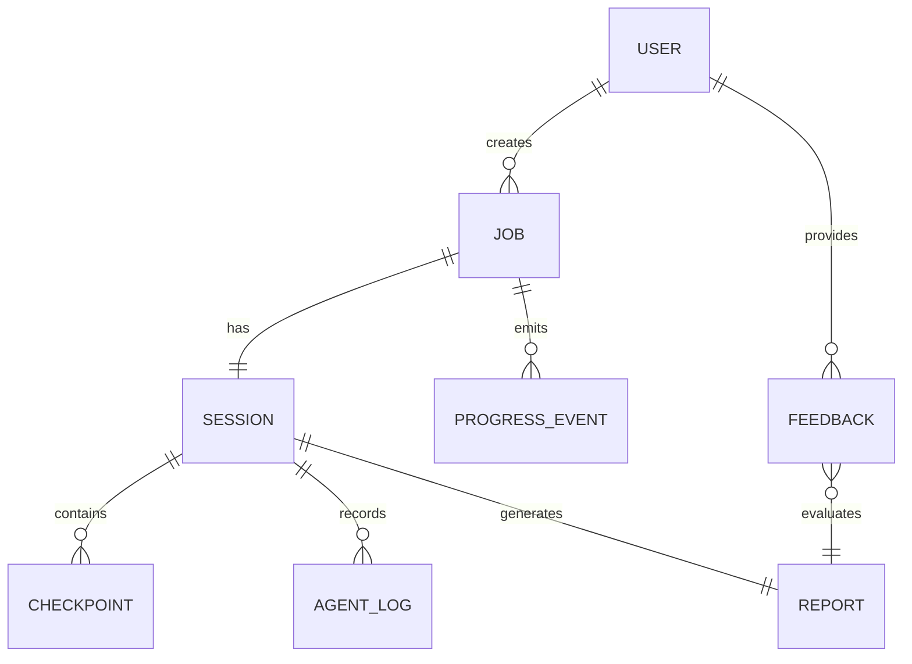
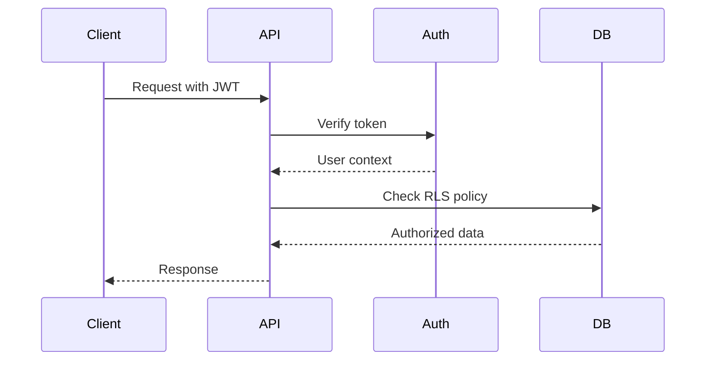
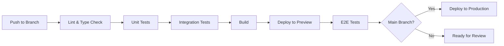

# Technical Design

## Overview
LangGraphを使用したマルチエージェントオーケストレーションシステムの技術設計。5つのエージェント（Researcher、Ideator、Critic、Analyst、Writer）を有向グラフとして接続し、ステートフルなワークフローを実現する。本設計では、Edge Functions環境での動作、並行処理管理、リアルタイム進捗配信、エラーリカバリーを考慮した堅牢なシステムアーキテクチャを提供する。

## Requirements Mapping

### Design Component Traceability
各設計コンポーネントが対応する要件：

- **AgentGraph (LangGraph)** → REQ-1.1-1.7: エージェントグラフとステートマシン構築
- **StateManager** → REQ-2.1-2.5: データフロー管理と型安全性
- **JobQueueService** → REQ-3.1-3.7: ジョブキューと並行処理管理
- **ProgressTracker (SSE)** → REQ-4.1-4.6: リアルタイム進捗追跡とSSE配信
- **ErrorHandler** → REQ-5.1-5.6: エラーハンドリングとリカバリー
- **CheckpointStore** → REQ-6.1-6.5: 状態管理と永続化
- **PerformanceMonitor** → REQ-7.1-7.5: パフォーマンスとスケーラビリティ
- **AuthMiddleware** → REQ-8.1-8.5: セキュリティとアクセス制御

### User Story Coverage
- **オペレーター向け機能**: AgentGraph、StateManager、CheckpointStoreによる自動実行
- **開発者向け機能**: 型定義、Zodスキーマ、エラーログによる開発支援
- **管理者向け機能**: JobQueueService、PerformanceMonitorによるリソース管理
- **エンドユーザー向け機能**: ProgressTracker、SSE配信による進捗可視化

## Architecture

### High-Level System Architecture

```mermaid
graph TB
    subgraph "Client Layer"
        UI[Dashboard UI]
        SSE[SSE Client]
    end
    
    subgraph "API Layer (Edge Functions)"
        API[/api/agents/generate]
        STREAM[/api/agents/jobs/id/stream]
        JOB[/api/agents/jobs/id]
    end
    
    subgraph "Orchestration Layer"
        GRAPH[AgentGraph<br/>LangGraph]
        QUEUE[JobQueueService]
        TRACKER[ProgressTracker]
    end
    
    subgraph "Agent Layer"
        R[Researcher]
        I[Ideator]
        C[Critic]
        A[Analyst]
        W[Writer]
    end
    
    subgraph "Data Layer"
        DB[(Supabase DB)]
        CACHE[State Cache]
    end
    
    UI -->|POST| API
    SSE -->|EventSource| STREAM
    API --> QUEUE
    QUEUE --> GRAPH
    GRAPH --> R --> I --> C --> A --> W
    GRAPH --> TRACKER
    TRACKER --> STREAM
    GRAPH --> CACHE
    CACHE --> DB
```

### Technology Stack

- **Orchestration Framework**: LangGraph (v0.0.26+)
- **State Management**: LangGraph StateGraph + Checkpointer
- **Queue System**: Database-backed FIFO (Supabase)
- **Real-time Communication**: Server-Sent Events (SSE)
- **Type Validation**: Zod schemas
- **Error Handling**: Exponential backoff retry
- **Monitoring**: Custom PerformanceMonitor
- **Testing**: Jest + E2E with Playwright

### Architecture Decision Rationale

- **Why LangGraph**: ステートフルなエージェント連携、チェックポイント機能、条件分岐サポート
- **Why Database Queue**: サーバーレス環境での永続性、トランザクション保証、可視性
- **Why SSE over WebSocket**: 単方向通信で十分、Edge Functions互換性、自動再接続
- **Why Zod Validation**: ランタイム型検証、TypeScript統合、エラーメッセージの品質

## Data Flow

### Primary Agent Execution Flow



### State Transition Diagram



## Components and Interfaces

### Backend Services & Method Signatures

```typescript
// lib/agents/orchestration/agent-graph.ts
class AgentGraph {
  constructor(config: GraphConfig)
  async compile(): Promise<CompiledGraph>
  async execute(input: GraphInput): Promise<GraphOutput>
  async checkpoint(state: GraphState): Promise<void>
  async resume(checkpointId: string): Promise<GraphOutput>
}

// lib/services/job-queue.ts
class JobQueueService {
  async enqueue(job: JobData): Promise<Job>
  async dequeue(): Promise<Job | null>
  async updateStatus(jobId: string, status: JobStatus): Promise<void>
  async getActiveJobs(): Promise<Job[]>
  async cancelJob(jobId: string): Promise<void>
}

// lib/services/progress-tracker.ts
class ProgressTracker {
  async startTracking(sessionId: string): Promise<void>
  async updateProgress(sessionId: string, progress: Progress): Promise<void>
  async sendEvent(sessionId: string, event: SSEEvent): Promise<void>
  async endTracking(sessionId: string): Promise<void>
}

// lib/agents/orchestration/state-manager.ts
class StateManager {
  validateInput<T>(data: unknown, schema: ZodSchema<T>): T
  transformOutput(agentName: string, output: unknown): AgentOutput
  mergeState(current: GraphState, update: Partial<GraphState>): GraphState
  serializeForCheckpoint(state: GraphState): string
}

// lib/agents/orchestration/error-handler.ts
class OrchestrationErrorHandler {
  async handleError(error: Error, context: ErrorContext): Promise<ErrorAction>
  async retry<T>(fn: () => Promise<T>, options: RetryOptions): Promise<T>
  logError(error: Error, metadata: ErrorMetadata): void
  shouldRetry(error: Error, attempt: number): boolean
}
```

### Frontend Components

| Component | Responsibility | Props/State Summary |
|-----------|---------------|-------------------|
| JobInitiator | ジョブ作成フォーム | theme, onSubmit |
| ProgressDisplay | 進捗表示（SSE接続） | jobId, onComplete |
| AgentStatus | 各エージェント状態表示 | agentName, status, progress |
| ReportViewer | 最終レポート表示 | reportData, onFeedback |
| JobHistory | ジョブ履歴一覧 | userId, onSelect |
| ErrorNotification | エラー通知 | error, onRetry, onDismiss |

### API Endpoints

| Method | Route | Purpose | Auth | Status Codes |
|--------|-------|---------|------|--------------|
| POST | /api/agents/generate | ジョブ作成・キュー追加 | Required | 201, 400, 401, 429, 500 |
| GET | /api/agents/jobs/:id | ジョブ詳細取得 | Required | 200, 401, 403, 404, 500 |
| GET | /api/agents/jobs/:id/stream | SSE接続確立 | Required | 200, 401, 403, 404 |
| DELETE | /api/agents/jobs/:id | ジョブキャンセル | Required | 204, 401, 403, 404, 500 |
| GET | /api/agents/jobs | ジョブ一覧取得 | Required | 200, 401, 500 |

## Data Models

### Domain Entities

1. **GraphState**: エージェント間で共有される状態
2. **Job**: キューで管理されるジョブ情報
3. **Checkpoint**: 永続化された中間状態
4. **AgentOutput**: 各エージェントの出力データ
5. **ProgressEvent**: SSEで配信される進捗イベント

### Entity Relationships



### Data Model Definitions

```typescript
// lib/types/orchestration.ts
interface GraphState {
  sessionId: string;
  jobId: string;
  theme?: string;
  currentAgent: AgentName;
  agentOutputs: {
    researcher?: ResearcherOutput;
    ideator?: IdeatorOutput;
    critic?: CriticOutput;
    analyst?: AnalystOutput;
    writer?: WriterOutput;
  };
  metadata: {
    startedAt: Date;
    updatedAt: Date;
    retryCount: number;
  };
}

interface Job {
  id: string;
  userId: string;
  sessionId: string;
  status: 'queued' | 'processing' | 'completed' | 'failed' | 'cancelled';
  priority: number;
  input: JobInput;
  output?: JobOutput;
  error?: string;
  createdAt: Date;
  startedAt?: Date;
  completedAt?: Date;
}

interface Checkpoint {
  id: string;
  sessionId: string;
  agentName: AgentName;
  state: GraphState;
  createdAt: Date;
}

interface ProgressEvent {
  type: 'agent_started' | 'agent_progress' | 'agent_completed' | 'error' | 'completed';
  sessionId: string;
  agentName?: AgentName;
  progress: number; // 0-100
  message?: string;
  data?: unknown;
  timestamp: Date;
}
```

### Database Schema Updates

```sql
-- generation_jobsテーブル（新規）
CREATE TABLE generation_jobs (
  id UUID PRIMARY KEY DEFAULT gen_random_uuid(),
  user_id UUID REFERENCES users(id) NOT NULL,
  session_id UUID REFERENCES ideation_sessions(id) NOT NULL,
  status TEXT CHECK (status IN ('queued', 'processing', 'completed', 'failed', 'cancelled')) NOT NULL,
  priority INTEGER DEFAULT 0,
  input JSONB NOT NULL,
  output JSONB,
  error TEXT,
  created_at TIMESTAMPTZ DEFAULT now(),
  started_at TIMESTAMPTZ,
  completed_at TIMESTAMPTZ,
  INDEX idx_jobs_status (status),
  INDEX idx_jobs_user (user_id),
  INDEX idx_jobs_created (created_at DESC)
);

-- checkpointsテーブル（新規）
CREATE TABLE checkpoints (
  id UUID PRIMARY KEY DEFAULT gen_random_uuid(),
  session_id UUID REFERENCES ideation_sessions(id) NOT NULL,
  agent_name TEXT NOT NULL,
  state JSONB NOT NULL,
  created_at TIMESTAMPTZ DEFAULT now(),
  INDEX idx_checkpoints_session (session_id, created_at DESC)
);

-- RLSポリシー
ALTER TABLE generation_jobs ENABLE ROW LEVEL SECURITY;
ALTER TABLE checkpoints ENABLE ROW LEVEL SECURITY;

CREATE POLICY jobs_user_access ON generation_jobs
  FOR ALL USING (user_id = auth.uid());

CREATE POLICY checkpoints_user_access ON checkpoints
  FOR SELECT USING (
    session_id IN (
      SELECT id FROM ideation_sessions WHERE user_id = auth.uid()
    )
  );
```

## Error Handling

### Error Categories and Strategies

| Error Type | Strategy | Max Retries | Backoff |
|------------|----------|-------------|---------|
| API Rate Limit | Exponential backoff | 3 | 1s, 2s, 4s |
| Network Timeout | Immediate retry | 2 | 500ms |
| Agent Failure | Resume from checkpoint | 2 | None |
| Validation Error | No retry, log detail | 0 | - |
| Database Error | Linear backoff | 3 | 1s |
| Fatal Error | Save partial, notify | 0 | - |

### Error Recovery Flow

```typescript
class ErrorRecoveryStrategy {
  async recover(error: OrchestrationError): Promise<RecoveryAction> {
    if (error.type === 'AGENT_FAILURE') {
      const checkpoint = await this.loadLastCheckpoint(error.sessionId);
      if (checkpoint) {
        return { action: 'RESUME', checkpointId: checkpoint.id };
      }
    }
    
    if (error.type === 'RATE_LIMIT') {
      const delay = this.calculateBackoff(error.attempt);
      return { action: 'RETRY', delay };
    }
    
    if (error.type === 'VALIDATION') {
      await this.savePartialResult(error.sessionId, error.partialData);
      return { action: 'FAIL', reason: error.message };
    }
    
    return { action: 'FAIL', reason: 'Unrecoverable error' };
  }
}
```

## Security Considerations

### Authentication & Authorization



### Authorization Matrix

| Role | Create Job | View Own Jobs | View All Jobs | Cancel Job | Admin Actions |
|------|------------|---------------|---------------|------------|---------------|
| User | ✓ | ✓ | ✗ | Own only | ✗ |
| Admin | ✓ | ✓ | ✓ | ✓ | ✓ |

### Data Protection

- **Input Validation**: 全入力をZodスキーマで検証
- **SQL Injection Prevention**: Parameterized queries使用
- **XSS Protection**: HTMLレポートのサニタイゼーション
- **CORS Configuration**: 信頼されたオリジンのみ許可
- **Rate Limiting**: ユーザーあたり10リクエスト/分

## Performance & Scalability

### Performance Targets

| Metric | Target | Measurement |
|--------|--------|-------------|
| Job Queue Latency | < 100ms | Enqueue to dequeue time |
| Agent Transition | < 500ms | Between agents |
| SSE Latency | < 50ms | Event dispatch time |
| Checkpoint Save | < 200ms | State persistence |
| Total Processing | < 10min | End-to-end for single job |
| Concurrent Jobs | 5 | System capacity |
| Memory per Job | < 512MB | Peak usage |

### Caching Strategy

- **Agent Output Cache**: 各エージェント出力を30分キャッシュ
- **Checkpoint Cache**: 最新3チェックポイントをメモリ保持
- **Job Status Cache**: アクティブジョブのステータスを1秒キャッシュ

### Scalability Approach

```typescript
// 並行処理制御
class ConcurrencyController {
  private readonly MAX_CONCURRENT = 5;
  private activeJobs = new Map<string, Job>();
  
  async canStartNewJob(): Promise<boolean> {
    const activeCount = await this.getActiveJobCount();
    return activeCount < this.MAX_CONCURRENT;
  }
  
  async waitForSlot(): Promise<void> {
    while (!await this.canStartNewJob()) {
      await new Promise(resolve => setTimeout(resolve, 1000));
    }
  }
}
```

## Testing Strategy

### Test Coverage Requirements

- **Unit Tests**: 各サービスクラス、エージェント統合点（80%+）
- **Integration Tests**: LangGraph統合、SSE配信、ジョブキュー
- **E2E Tests**: 完全なジョブ実行フロー、エラーリカバリー
- **Performance Tests**: 並行処理、メモリリーク、レスポンス時間

### Testing Approach

```typescript
// __tests__/orchestration/agent-graph.test.ts
describe('AgentGraph', () => {
  it('should execute agents in correct order', async () => {
    const graph = new AgentGraph(testConfig);
    const result = await graph.execute(testInput);
    expect(result.executionOrder).toEqual([
      'researcher', 'ideator', 'critic', 'analyst', 'writer'
    ]);
  });
  
  it('should resume from checkpoint on failure', async () => {
    const graph = new AgentGraph(testConfig);
    // Simulate failure at critic
    await expect(graph.execute(failingInput)).rejects.toThrow();
    
    // Resume should start from critic
    const resumed = await graph.resume(checkpointId);
    expect(resumed.startedFrom).toBe('critic');
  });
});

// __tests__/e2e/full-flow.test.ts
describe('Full Job Execution', () => {
  it('should complete job within 10 minutes', async () => {
    const jobId = await createJob(testTheme);
    const startTime = Date.now();
    
    await waitForCompletion(jobId);
    
    const duration = Date.now() - startTime;
    expect(duration).toBeLessThan(10 * 60 * 1000);
  });
});
```

### CI/CD Pipeline



---