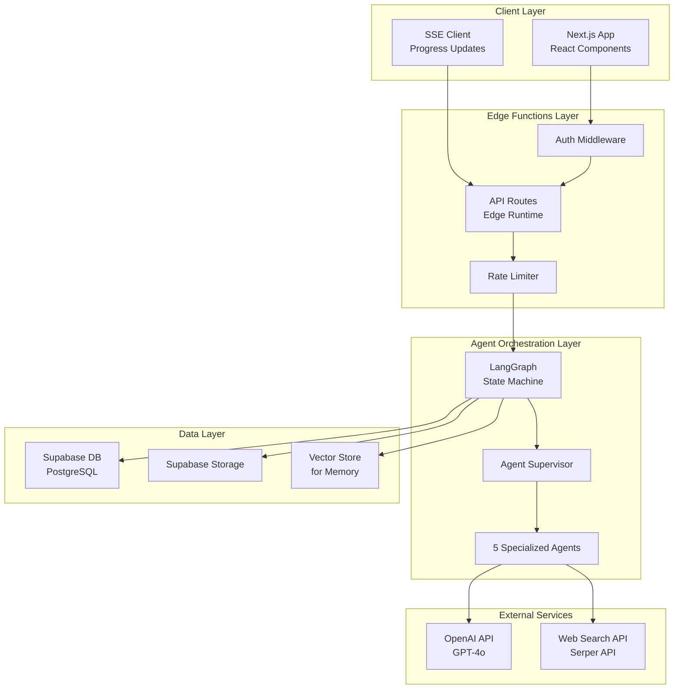
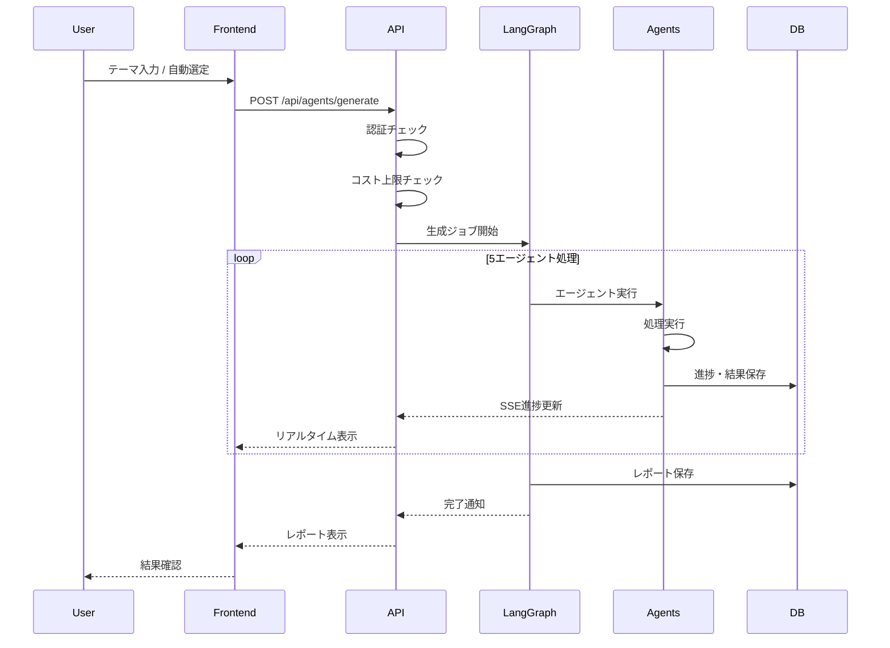
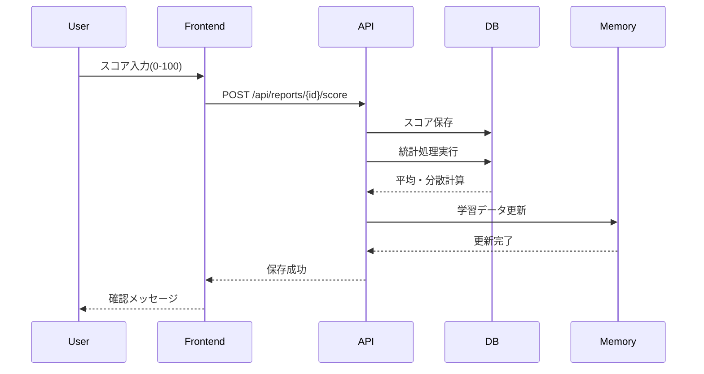
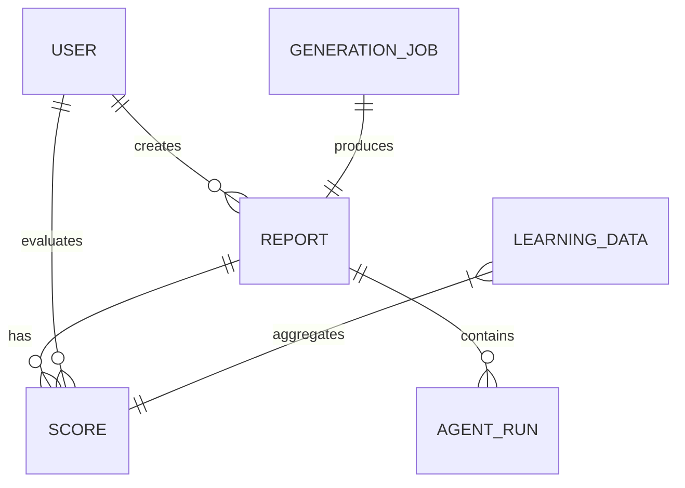
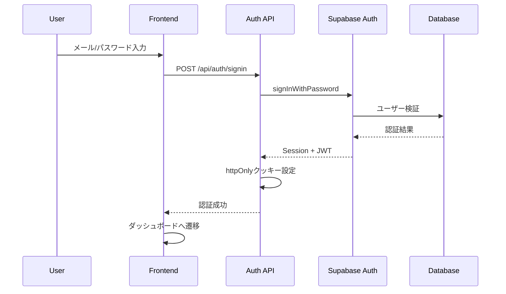
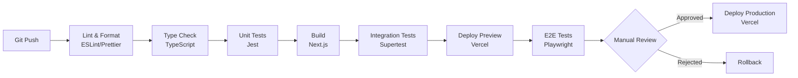

# Technical Design

## Overview
本システムは、三菱地所の新事業創出を加速する自律型アイディエーションエージェントAIのWebアプリケーションです。Next.js 15のApp RouterとLangGraph/LangChainを活用し、5つの専門エージェントが協調して市場調査からビジネスアイデア生成、評価、詳細分析、レポート作成までを完全自動化します。Edge Functions上で動作し、Supabaseによるサーバーレスアーキテクチャを採用することで、高いスケーラビリティとコスト効率を実現します。

## Requirements Mapping

### Design Component Traceability
各設計コンポーネントが対応する要件：

- **認証システム（Supabase Auth）** → REQ-1: 認証・ユーザー管理
- **エージェントオーケストレーター（LangGraph）** → REQ-2: ビジネスアイデア生成フロー、REQ-3: 多エージェントシステム
- **リアルタイムUI（Server-Sent Events）** → REQ-2.4: リアルタイム進捗表示
- **レポートビューワー（React Components）** → REQ-4: レポート管理・表示
- **評価システム（Database + API）** → REQ-5: 評価・フィードバックシステム
- **セキュリティレイヤー（RLS + Middleware）** → REQ-6: セキュリティ・データ保護
- **並行処理管理（Queue System）** → REQ-7: パフォーマンス・スケーラビリティ
- **開発環境（Next.js + Tools）** → REQ-8: 開発・運用サポート

### User Story Coverage
- **認証フロー**: Supabase Authのパスワード認証とセッション管理
- **アイデア生成**: LangGraphによる5エージェントの協調動作とSSEによる進捗表示
- **レポート管理**: タブ形式HTMLレポートとSupabase DBによる履歴管理
- **評価システム**: スコア入力UIと統計処理による学習システム
- **セキュリティ**: RLSによるマルチテナンシーとCSRF対策

## Architecture



### Technology Stack

- **Frontend**: Next.js 15 (App Router) + TypeScript + React 19
- **UI Components**: shadcn/ui + TailwindCSS
- **Backend**: Next.js API Routes (Edge Functions)
- **AI Framework**: LangGraph + LangChain
- **Database**: Supabase (PostgreSQL with RLS)
- **Authentication**: Supabase Auth (Password-based)
- **Real-time**: Server-Sent Events (SSE)
- **Deployment**: Vercel (Edge Runtime)
- **Monitoring**: Vercel Analytics + Custom Telemetry

### Architecture Decision Rationale

- **Why Next.js 15 App Router**: 最新のReact Server Componentsによるパフォーマンス最適化、Edge Runtimeサポート、優れたDX
- **Why LangGraph**: 状態管理とエージェント間の協調動作に特化、エンタープライズ実績（Klarna、AppFolio）
- **Why Supabase**: RLSによる強力なセキュリティ、リアルタイム機能、コスト効率的なサーバーレス構成
- **Why Edge Functions**: 低レイテンシ、グローバル分散、自動スケーリング、コスト最適化
- **Why SSE over WebSocket**: エージェント進捗の一方向通信に最適、実装がシンプル、Edge Functions互換
- **Why Serper API**: シンプルなREST API、日本語検索に対応、レート制限が寛容、料金体系が明確

## Data Flow

### Primary User Flows

#### 1. ビジネスアイデア生成フロー


#### 2. 評価フィードバックフロー


## Components and Interfaces

### Backend Services & Method Signatures

#### AgentOrchestrationService
```typescript
class AgentOrchestrationService {
  async startGeneration(input: GenerationInput): Promise<GenerationJob>  // ジョブ開始
  async getJobStatus(jobId: string): Promise<JobStatus>                 // 状態取得
  async cancelJob(jobId: string): Promise<void>                         // ジョブキャンセル
  streamProgress(jobId: string): AsyncGenerator<ProgressEvent>          // 進捗ストリーム
}
```

#### ReportService
```typescript
class ReportService {
  async createReport(data: ReportData): Promise<Report>                 // レポート作成
  async getReports(userId: string): Promise<Report[]>                   // 一覧取得
  async getReport(id: string, userId: string): Promise<Report>          // 詳細取得
  async deleteReport(id: string, userId: string): Promise<void>         // 削除
}
```

#### ScoreService
```typescript
class ScoreService {
  async saveScore(data: ScoreData): Promise<Score>                      // スコア保存
  async getReportScores(reportId: string): Promise<Score[]>             // スコア取得
  async calculateStats(reportId: string): Promise<ScoreStats>           // 統計計算
  async updateLearningData(): Promise<void>                             // 学習データ更新
}
```

#### AuthService
```typescript
class AuthService {
  async signIn(email: string, password: string): Promise<Session>       // サインイン
  async signOut(): Promise<void>                                        // サインアウト
  async getUser(): Promise<User | null>                                 // ユーザー取得
  async updateProfile(data: ProfileData): Promise<User>                 // プロフィール更新
}
```

#### WebSearchService
```typescript
class WebSearchService {
  async search(query: string, options?: SearchOptions): Promise<SearchResult[]>  // Web検索実行
  async searchWithRetry(query: string, maxRetries: number = 3): Promise<SearchResult[]>  // リトライ付き検索
  async batchSearch(queries: string[]): Promise<SearchResult[][]>  // 複数クエリの並列検索
  validateApiKey(): Promise<boolean>  // APIキー検証
}

interface SearchOptions {
  num?: number;          // 結果数（デフォルト: 10）
  gl?: string;          // 国コード（デフォルト: 'jp'）
  hl?: string;          // 言語（デフォルト: 'ja'）
  type?: 'search' | 'news' | 'images';  // 検索タイプ
}

interface SearchResult {
  title: string;
  link: string;
  snippet: string;
  position: number;
  date?: string;
}
```

### Frontend Components

| Component Name | Responsibility | Props/State Summary |
|----------------|----------------|---------------------|
| `DashboardLayout` | メインレイアウト、ナビゲーション | user, children |
| `IdeationForm` | テーマ入力、生成開始 | onSubmit, defaultTheme |
| `ProgressTracker` | リアルタイム進捗表示 | jobId, onComplete |
| `ReportViewer` | タブ形式レポート表示 | report, onScore |
| `ReportTabs` | 5つのタブコンテンツ管理 | sections, activeTab |
| `ScoreForm` | 評価入力フォーム | reportId, onSubmit |
| `ReportList` | レポート履歴一覧 | reports, onSelect |
| `AgentStatus` | 各エージェント状態表示 | agent, status, progress |
| `ErrorBoundary` | エラーハンドリング | fallback, onReset |
| `AuthGuard` | 認証保護ラッパー | children, redirectTo |

### API Endpoints

| Method | Route | Purpose | Auth | Status Codes |
|--------|-------|---------|------|--------------|
| POST | /api/auth/signin | サインイン | No | 200, 400, 401, 500 |
| POST | /api/auth/signout | サインアウト | Required | 200, 401, 500 |
| GET | /api/auth/session | セッション確認 | Required | 200, 401 |
| POST | /api/agents/generate | 生成開始 | Required | 201, 400, 401, 429, 500 |
| GET | /api/agents/jobs/:id | ジョブ状態取得 | Required | 200, 401, 404, 500 |
| GET | /api/agents/jobs/:id/stream | 進捗ストリーム | Required | 200 (SSE), 401, 404 |
| DELETE | /api/agents/jobs/:id | ジョブキャンセル | Required | 204, 401, 404, 500 |
| GET | /api/reports | レポート一覧 | Required | 200, 401, 500 |
| GET | /api/reports/:id | レポート詳細 | Required | 200, 401, 404, 500 |
| POST | /api/reports/:id/score | スコア保存 | Required | 201, 400, 401, 404, 500 |
| GET | /api/reports/:id/scores | スコア取得 | Required | 200, 401, 404, 500 |
| GET | /api/stats/usage | 使用状況統計 | Required | 200, 401, 500 |

## Data Models

### Domain Entities
1. **User**: システムユーザー（三菱地所新事業担当者）
2. **Report**: 生成されたビジネスアイデアレポート
3. **Score**: ユーザーによる評価スコア
4. **AgentRun**: 各エージェントの実行履歴
5. **GenerationJob**: アイデア生成ジョブ
6. **LearningData**: フィードバック学習データ

### Entity Relationships


### Data Model Definitions

#### TypeScript Interfaces
```typescript
interface User {
  id: string;
  email: string;
  name: string;
  department?: string;
  role: 'user' | 'admin';
  createdAt: Date;
  updatedAt: Date;
}

interface Report {
  id: string;
  userId: string;
  title: string;
  summary: string;
  theme?: string;  // ユーザー入力テーマ
  content: {
    summary: ReportSection;
    businessModel: BusinessModelSection;
    marketAnalysis: MarketSection;
    synergyAnalysis: SynergySection;
    validationPlan: ValidationSection;
  };
  status: 'pending' | 'processing' | 'completed' | 'failed';
  errorMessage?: string;
  createdAt: Date;
  updatedAt: Date;
}

interface Score {
  id: string;
  reportId: string;
  userId: string;
  marketScore: number;      // 0-50
  synergyScore: number;     // 0-50
  totalScore: number;       // 0-100
  comment?: string;
  createdAt: Date;
}

interface AgentRun {
  id: string;
  reportId: string;
  jobId: string;
  agentName: 'broad_researcher' | 'ideator' | 'critic' | 'analyst' | 'writer';
  input: any;
  output: any;
  tokensUsed: number;
  duration: number;         // milliseconds
  status: 'running' | 'completed' | 'failed';
  error?: string;
  createdAt: Date;
  completedAt?: Date;
}

interface GenerationJob {
  id: string;
  userId: string;
  theme?: string;
  status: 'queued' | 'running' | 'completed' | 'failed' | 'cancelled';
  progress: number;         // 0-100
  currentAgent?: string;
  reportId?: string;
  error?: string;
  createdAt: Date;
  startedAt?: Date;
  completedAt?: Date;
}
```

### Database Schema
```sql
-- ユーザーテーブル
CREATE TABLE users (
  id UUID PRIMARY KEY DEFAULT gen_random_uuid(),
  email TEXT UNIQUE NOT NULL,
  name TEXT NOT NULL,
  department TEXT,
  role TEXT DEFAULT 'user' CHECK (role IN ('user', 'admin')),
  created_at TIMESTAMPTZ DEFAULT NOW(),
  updated_at TIMESTAMPTZ DEFAULT NOW()
);

-- レポートテーブル
CREATE TABLE reports (
  id UUID PRIMARY KEY DEFAULT gen_random_uuid(),
  user_id UUID REFERENCES users(id) ON DELETE CASCADE,
  title TEXT NOT NULL,
  summary TEXT NOT NULL,
  theme TEXT,
  content JSONB NOT NULL,
  status TEXT DEFAULT 'pending' CHECK (status IN ('pending', 'processing', 'completed', 'failed')),
  error_message TEXT,
  created_at TIMESTAMPTZ DEFAULT NOW(),
  updated_at TIMESTAMPTZ DEFAULT NOW()
);

-- スコアテーブル
CREATE TABLE scores (
  id UUID PRIMARY KEY DEFAULT gen_random_uuid(),
  report_id UUID REFERENCES reports(id) ON DELETE CASCADE,
  user_id UUID REFERENCES users(id) ON DELETE CASCADE,
  market_score INTEGER CHECK (market_score >= 0 AND market_score <= 50),
  synergy_score INTEGER CHECK (synergy_score >= 0 AND synergy_score <= 50),
  total_score INTEGER GENERATED ALWAYS AS (market_score + synergy_score) STORED,
  comment TEXT,
  created_at TIMESTAMPTZ DEFAULT NOW(),
  UNIQUE(report_id, user_id)
);

-- エージェント実行履歴
CREATE TABLE agent_runs (
  id UUID PRIMARY KEY DEFAULT gen_random_uuid(),
  report_id UUID REFERENCES reports(id) ON DELETE CASCADE,
  job_id UUID NOT NULL,
  agent_name TEXT NOT NULL,
  input JSONB,
  output JSONB,
  tokens_used INTEGER DEFAULT 0,
  duration INTEGER,
  status TEXT DEFAULT 'running',
  error TEXT,
  created_at TIMESTAMPTZ DEFAULT NOW(),
  completed_at TIMESTAMPTZ
);

-- 生成ジョブテーブル
CREATE TABLE generation_jobs (
  id UUID PRIMARY KEY DEFAULT gen_random_uuid(),
  user_id UUID REFERENCES users(id) ON DELETE CASCADE,
  theme TEXT,
  status TEXT DEFAULT 'queued',
  progress INTEGER DEFAULT 0,
  current_agent TEXT,
  report_id UUID REFERENCES reports(id),
  error TEXT,
  created_at TIMESTAMPTZ DEFAULT NOW(),
  started_at TIMESTAMPTZ,
  completed_at TIMESTAMPTZ
);

-- インデックス作成
CREATE INDEX idx_reports_user_id ON reports(user_id);
CREATE INDEX idx_reports_status ON reports(status);
CREATE INDEX idx_scores_report_id ON scores(report_id);
CREATE INDEX idx_agent_runs_report_id ON agent_runs(report_id);
CREATE INDEX idx_agent_runs_job_id ON agent_runs(job_id);
CREATE INDEX idx_generation_jobs_user_id ON generation_jobs(user_id);
CREATE INDEX idx_generation_jobs_status ON generation_jobs(status);
```

### Migration Strategy
- **アプローチ**: Supabase Migrationsによる宣言的スキーマ管理
- **バージョン管理**: タイムスタンプベースの連番マイグレーション
- **ロールバック**: 各マイグレーションに対応するdownスクリプト
- **データ変換**: JSONB型により柔軟なスキーマ進化をサポート
- **インデックス戦略**: RLSポリシーと頻繁なクエリパターンに基づく最適化

## Error Handling

### エラー分類と処理戦略

#### 1. API通信エラー
- **ネットワークエラー**: 自動リトライ（最大3回、指数バックオフ）
- **タイムアウト**: ユーザーに通知し、再実行オプション提供
- **レート制限**: 429エラー時は待機時間を表示

#### 2. LLMエラー
- **トークン上限**: プロンプト圧縮または分割処理
- **API制限**: 月額上限到達時は明確なメッセージ表示
- **生成エラー**: 2回リトライ後、詳細エラーログと共に失敗

#### 3. データベースエラー
- **RLS違反**: 401エラーとして処理、再認証を促す
- **制約違反**: ユーザーフレンドリーなメッセージに変換
- **接続エラー**: サーキットブレーカーパターンで保護

#### 4. Web検索APIエラー
- **APIキー無効**: 起動時検証、無効時は明確なエラー表示
- **レート制限**: 1分あたり100リクエスト上限、超過時は待機
- **検索失敗**: 3回リトライ、失敗時は空の結果で処理継続
- **タイムアウト**: 5秒でタイムアウト、代替データソース使用

#### 5. エラー表示戦略
```typescript
class ErrorBoundary extends React.Component {
  static getDerivedStateFromError(error: Error) {
    return { hasError: true, error };
  }
  
  componentDidCatch(error: Error, info: ErrorInfo) {
    // エラーログ送信
    logErrorToService(error, info);
  }
}
```

## Security Considerations

### Authentication & Authorization

#### 認証フロー


#### 認可マトリックス
| リソース | 操作 | user | admin | 条件 |
|----------|------|------|-------|------|
| Reports | CREATE | ✓ | ✓ | APIコスト上限内 |
| Reports | READ | ✓ | ✓ | 自分のレポートのみ |
| Reports | UPDATE | ✗ | ✓ | - |
| Reports | DELETE | ✓ | ✓ | 自分のレポートのみ |
| Scores | CREATE | ✓ | ✓ | レポート所有者のみ |
| Scores | READ | ✓ | ✓ | 自分のスコアのみ |
| Users | READ | ✓ | ✓ | 自分の情報のみ |
| Users | UPDATE | ✓ | ✓ | 自分の情報のみ |

### Data Protection

#### RLSポリシー実装
```sql
-- レポートのRLSポリシー
ALTER TABLE reports ENABLE ROW LEVEL SECURITY;

CREATE POLICY "Users can view own reports" ON reports
  FOR SELECT USING (auth.uid() = user_id);

CREATE POLICY "Users can create reports" ON reports
  FOR INSERT WITH CHECK (auth.uid() = user_id);

CREATE POLICY "Users can delete own reports" ON reports
  FOR DELETE USING (auth.uid() = user_id);

-- スコアのRLSポリシー
ALTER TABLE scores ENABLE ROW LEVEL SECURITY;

CREATE POLICY "Users can manage own scores" ON scores
  FOR ALL USING (auth.uid() = user_id);

-- パフォーマンス最適化インデックス
CREATE INDEX idx_reports_user_id_btree ON reports USING btree (user_id);
CREATE INDEX idx_scores_user_id_btree ON scores USING btree (user_id);
```

#### セキュリティヘッダー
```typescript
// middleware.ts
export function middleware(request: NextRequest) {
  const response = NextResponse.next();
  
  // セキュリティヘッダー設定
  response.headers.set('X-Frame-Options', 'DENY');
  response.headers.set('X-Content-Type-Options', 'nosniff');
  response.headers.set('Referrer-Policy', 'strict-origin-when-cross-origin');
  response.headers.set('Permissions-Policy', 'camera=(), microphone=(), geolocation=()');
  
  // CSRF対策
  if (request.method !== 'GET') {
    const token = request.headers.get('x-csrf-token');
    if (!verifyCSRFToken(token)) {
      return new Response('Invalid CSRF token', { status: 403 });
    }
  }
  
  return response;
}
```

### Security Best Practices

1. **入力検証**: Zodによるスキーマ検証をすべてのAPIエンドポイントで実装
2. **SQLインジェクション対策**: パラメータ化クエリとSupabase RLSの活用
3. **XSS対策**: React自動エスケープとContent Security Policy
4. **レート制限**: Vercel Edge ConfigによるIP/ユーザーベース制限
5. **シークレット管理**: 環境変数とVercel環境変数による安全な管理
6. **監査ログ**: すべての重要操作をagent_runsテーブルに記録

## Performance & Scalability

### Performance Targets
| Metric | Target | Measurement |
|--------|--------|-------------|
| 初期ページロード | < 2秒 | Lighthouse Score |
| API レスポンス (p95) | < 200ms | Vercel Analytics |
| API レスポンス (p99) | < 500ms | Vercel Analytics |
| エージェント処理完了 | < 10分 | Custom Metrics |
| 同時実行ジョブ | 5 | Queue System |
| 月間生成数 | > 100件 | Database Query |

### Caching Strategy
- **ブラウザキャッシュ**: 静的アセット（1年）、APIレスポンス（5分）
- **CDN (Vercel Edge)**: 画像、フォント、静的ファイル
- **React Query**: クライアントサイドAPIキャッシュ（5分）
- **Supabase Query Cache**: 頻繁なクエリ結果（1分）
- **LangGraph Memory**: エージェント学習データ（24時間）
- **Serper API Cache**: 同一検索クエリ結果（1時間）

### Scalability Approach

#### 1. エージェント並行処理
```typescript
// キューシステムによる並行制御
class JobQueue {
  private running = 0;
  private queue: Job[] = [];
  private readonly MAX_CONCURRENT = 5;
  
  async add(job: Job) {
    if (this.running < this.MAX_CONCURRENT) {
      this.running++;
      await this.process(job);
    } else {
      this.queue.push(job);
    }
  }
}
```

#### 2. データベース最適化
- **Read Replicas**: レポート読み取り専用レプリカ
- **Connection Pooling**: Supabase接続プール（最大25）
- **Partial Indexes**: アクティブレポートのみインデックス
- **JSONB最適化**: GINインデックスによる高速検索

#### 3. Edge Functions最適化
- **コールドスタート削減**: 軽量な関数設計（< 50KB）
- **リージョン選択**: 東京リージョン優先配置
- **バンドルサイズ**: Tree shakingとコード分割
- **ストリーミング**: Server-Sent Eventsによる効率的な通信

## Web Search API Integration

### Serper API選定理由
- **シンプルなREST API**: 複雑な認証やSDK不要、HTTPリクエストのみで利用可能
- **日本語検索サポート**: gl=jp, hl=jaパラメータで日本市場に最適化
- **豊富な検索タイプ**: 通常検索、ニュース、画像検索に対応
- **レート制限の寛容さ**: 1分100リクエスト、月間2,500クエリの無料枠
- **低レイテンシ**: 平均応答時間 < 500ms

### API実装詳細

#### 1. 基本的な検索実装
```typescript
// lib/services/web-search.ts
import { z } from 'zod';

const SerperResponseSchema = z.object({
  searchParameters: z.object({
    q: z.string(),
    gl: z.string(),
    hl: z.string(),
  }),
  organic: z.array(z.object({
    title: z.string(),
    link: z.string(),
    snippet: z.string(),
    position: z.number(),
  })),
  news: z.array(z.object({
    title: z.string(),
    link: z.string(),
    snippet: z.string(),
    date: z.string(),
  })).optional(),
});

export class SerperSearchService implements WebSearchService {
  private readonly apiKey: string;
  private readonly baseUrl = 'https://google.serper.dev/search';
  private cache = new Map<string, { data: SearchResult[], timestamp: number }>();
  private readonly CACHE_TTL = 60 * 60 * 1000; // 1時間

  constructor(apiKey: string) {
    this.apiKey = apiKey;
  }

  async search(query: string, options?: SearchOptions): Promise<SearchResult[]> {
    // キャッシュチェック
    const cacheKey = `${query}-${JSON.stringify(options)}`;
    const cached = this.cache.get(cacheKey);
    if (cached && Date.now() - cached.timestamp < this.CACHE_TTL) {
      return cached.data;
    }

    const response = await fetch(this.baseUrl, {
      method: 'POST',
      headers: {
        'X-API-KEY': this.apiKey,
        'Content-Type': 'application/json',
      },
      body: JSON.stringify({
        q: query,
        gl: options?.gl || 'jp',
        hl: options?.hl || 'ja',
        num: options?.num || 10,
      }),
    });

    if (!response.ok) {
      throw new Error(`Serper API error: ${response.status}`);
    }

    const data = SerperResponseSchema.parse(await response.json());
    const results = data.organic.map(item => ({
      title: item.title,
      link: item.link,
      snippet: item.snippet,
      position: item.position,
    }));

    // キャッシュ保存
    this.cache.set(cacheKey, { data: results, timestamp: Date.now() });
    
    return results;
  }
}
```

#### 2. Broad Researcherエージェントでの使用
```typescript
// lib/agents/broad-researcher.ts
export class BroadResearcherAgent {
  constructor(
    private searchService: WebSearchService,
    private llm: ChatOpenAI
  ) {}

  async research(theme: string): Promise<ResearchResult> {
    // 検索クエリ生成
    const queries = await this.generateSearchQueries(theme);
    
    // 並列検索実行
    const searchPromises = queries.map(query => 
      this.searchService.searchWithRetry(query, 3)
    );
    const searchResults = await Promise.all(searchPromises);
    
    // 結果の要約と統合
    const summary = await this.summarizeResults(searchResults.flat());
    
    return {
      theme,
      queries,
      rawResults: searchResults.flat(),
      summary,
      sources: this.extractUniqueSources(searchResults.flat()),
    };
  }

  private async generateSearchQueries(theme: string): Promise<string[]> {
    // LLMを使用して効果的な検索クエリを生成
    const prompt = `
    以下のテーマについて、包括的な市場調査を行うための検索クエリを5つ生成してください。
    テーマ: ${theme}
    
    クエリは以下の観点を含むようにしてください：
    1. 市場規模と成長性
    2. 主要プレーヤーと競合状況
    3. 最新トレンドと技術動向
    4. 規制と政策動向
    5. 顧客ニーズと課題
    `;
    
    const response = await this.llm.invoke(prompt);
    return this.parseQueries(response.content);
  }
}
```

### エージェント別の検索戦略

| エージェント | 検索目的 | クエリタイプ | 結果数 |
|-------------|---------|------------|--------|
| Broad Researcher | 包括的市場調査 | 一般検索 + ニュース | 10-20件/クエリ |
| Analyst | 競合分析・詳細調査 | 企業名 + 特定キーワード | 5-10件/クエリ |
| Critic | 評価データ収集 | 統計・レポート検索 | 5件/クエリ |

### レート制限とコスト管理

```typescript
// lib/utils/rate-limiter.ts
export class RateLimiter {
  private requests: number[] = [];
  private readonly windowMs = 60 * 1000; // 1分
  private readonly maxRequests = 100;

  async checkLimit(): Promise<boolean> {
    const now = Date.now();
    this.requests = this.requests.filter(time => now - time < this.windowMs);
    
    if (this.requests.length >= this.maxRequests) {
      const oldestRequest = this.requests[0];
      const waitTime = this.windowMs - (now - oldestRequest);
      await new Promise(resolve => setTimeout(resolve, waitTime));
    }
    
    this.requests.push(now);
    return true;
  }
}
```

### 環境変数設定
```env
# Web Search Configuration
SERPER_API_KEY=your_api_key_here
SERPER_API_TIMEOUT=5000           # 5秒タイムアウト
SERPER_CACHE_TTL=3600000          # 1時間キャッシュ
SERPER_MAX_RETRIES=3              # 最大リトライ回数
```

## Testing Strategy

### Test Coverage Requirements
- **Unit Tests**: ≥80% カバレッジ（ビジネスロジック重点）
- **Integration Tests**: 全APIエンドポイントとDB操作
- **E2E Tests**: 5つの主要ユーザージャーニー
- **Performance Tests**: 想定ピーク時の2倍負荷

### Testing Approach

#### 1. Unit Testing
```typescript
// エージェントロジックのテスト例
describe('IdeatorAgent', () => {
  it('should generate 5 business ideas', async () => {
    const mockResearch = { /* モックデータ */ };
    const ideas = await ideatorAgent.generate(mockResearch);
    expect(ideas).toHaveLength(5);
    expect(ideas[0]).toHaveProperty('businessModel');
  });
});
```

#### 2. Integration Testing
```typescript
// API統合テスト例
describe('POST /api/agents/generate', () => {
  it('should start generation job', async () => {
    const response = await request(app)
      .post('/api/agents/generate')
      .set('Authorization', `Bearer ${token}`)
      .send({ theme: 'スマートシティ' });
      
    expect(response.status).toBe(201);
    expect(response.body).toHaveProperty('jobId');
  });
});
```

#### 3. End-to-End Testing
1. **認証フロー**: サインイン → ダッシュボード表示
2. **アイデア生成**: テーマ入力 → 進捗確認 → レポート表示
3. **評価フロー**: レポート選択 → スコア入力 → 保存確認
4. **履歴管理**: 一覧表示 → フィルタリング → 詳細表示
5. **エラー処理**: API制限 → エラー表示 → リトライ

#### 4. Performance Testing
```yaml
# k6による負荷テスト設定
scenarios:
  concurrent_generation:
    executor: 'constant-vus'
    vus: 10
    duration: '10m'
  spike_test:
    executor: 'ramping-vus'
    stages:
      - duration: '2m', target: 50
      - duration: '5m', target: 50
      - duration: '2m', target: 0
```

### CI/CD Pipeline


### 品質保証プロセス
1. **プルリクエスト**: 自動テスト必須、コードレビュー必須
2. **ステージング環境**: 本番同等環境での最終確認
3. **カナリアリリース**: 5%のユーザーから段階的展開
4. **モニタリング**: エラー率、パフォーマンス、使用状況の継続監視