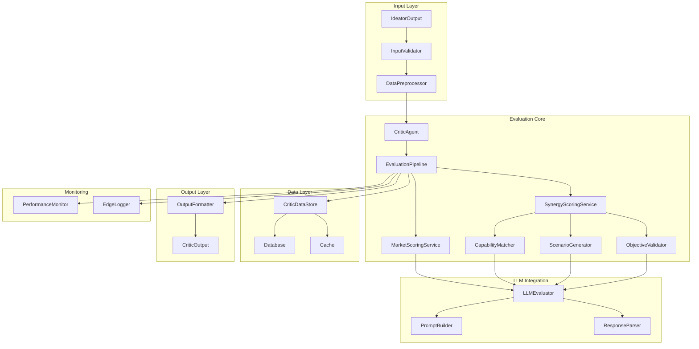
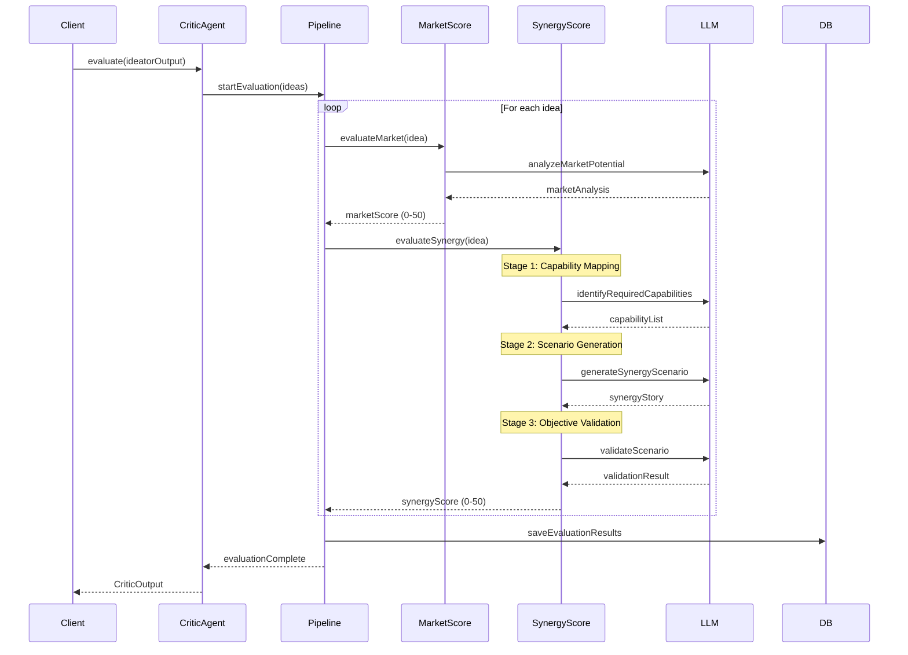
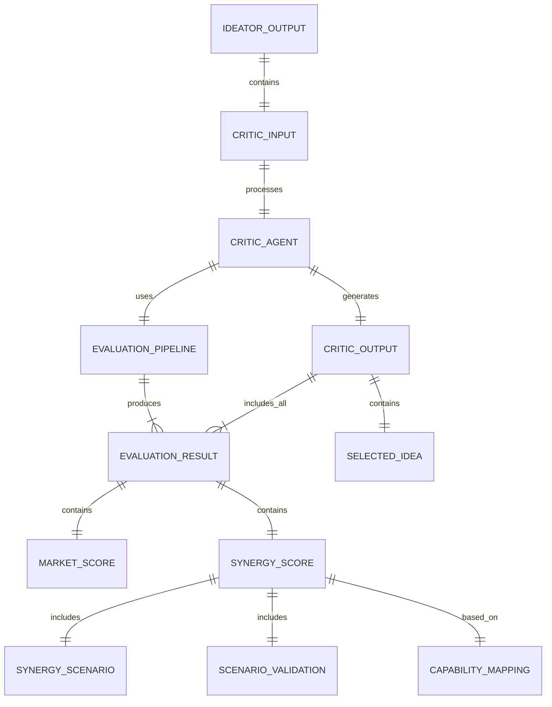
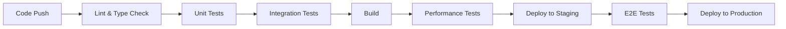

# Technical Design

## Overview
Criticエージェントは、Ideatorエージェントが生成した5つのビジネスアイデアを評価し、最も有望なアイデアを選定する評価専門エージェントです。市場規模（50点）と三菱地所シナジー（50点）の2軸評価により、定量的かつ客観的な判断を実現します。特に三菱地所の詳細なケイパビリティ分析により、「なぜ三菱地所が圧倒的に有利か」を論理的に立証する多段階評価プロセスを実装します。

## Requirements Mapping

### Design Component Traceability
各設計コンポーネントが対応する要件:
- **CriticAgent クラス** → REQ-1.1, 1.3, 1.6: アイデア評価機能の中核実装
- **EvaluationPipeline** → REQ-1.3, 9.1: 多段階評価プロセスの実装
- **MarketScoringService** → REQ-1.2, 1.4: 市場規模評価ロジック
- **SynergyScoringService** → REQ-1.3, 9.2, 9.3: 三菱地所シナジー評価ロジック
- **CapabilityMatcher** → REQ-9.1, 9.4: ケイパビリティマッチング
- **LLMEvaluator** → REQ-2.1-2.5: LLM統合による評価実装
- **CriticDataStore** → REQ-3.1-3.4: 評価データの構造化と保存
- **ErrorHandler** → REQ-6.1-6.5: エラーハンドリングと信頼性
- **PerformanceMonitor** → REQ-5.1-5.5: パフォーマンス最適化

### User Story Coverage
- 新事業担当者向け機能: CriticAgent、EvaluationPipeline、出力フォーマット
- AIシステム管理者向け機能: LLMEvaluator、ErrorHandler、ログ記録
- データアナリスト向け機能: CriticDataStore、構造化出力、分析可能な評価詳細
- ビジネス戦略担当者向け機能: カスタマイズ可能な評価重み、三菱地所固有評価
- システム運用者向け機能: PerformanceMonitor、並行処理、キャッシュ機能

## Architecture



### Technology Stack
- **言語**: TypeScript
- **ランタイム**: Next.js Edge Functions
- **LLM統合**: LangChain + OpenAI GPT-4o
- **データベース**: Supabase (PostgreSQL)
- **バリデーション**: Zod
- **キャッシュ**: In-memory LRU Cache
- **ログ**: EdgeLogger (Edge Functions互換)
- **テスト**: Jest + Testing Library

### Architecture Decision Rationale
- **TypeScript**: 既存システムとの統合性、型安全性の確保
- **Edge Functions**: fs依存なし、低レイテンシ、スケーラビリティ
- **LangChain**: 柔軟なプロンプト管理、LLM統合の標準化
- **Zod**: ランタイム型検証、エラーハンドリングの簡素化
- **LRU Cache**: 同一アイデアの再評価防止、パフォーマンス向上

## Data Flow

### Primary Evaluation Flow



## Components and Interfaces

### Backend Services & Method Signatures

```typescript
// lib/agents/critic/critic-agent.ts
class CriticAgent extends BaseAgent {
    constructor(context: BaseAgentContext, config?: CriticConfig)
    async execute(input: IdeatorOutput): Promise<AgentExecutionResult>
    getAgentName(): 'critic'
}

// lib/agents/critic/services/evaluation-pipeline.ts
class EvaluationPipeline {
    async evaluate(ideas: BusinessIdea[]): Promise<EvaluationResult[]>
    async selectBestIdea(results: EvaluationResult[]): Promise<SelectedIdea>
    private async evaluateSingle(idea: BusinessIdea): Promise<EvaluationResult>
}

// lib/agents/critic/services/market-scoring-service.ts
class MarketScoringService {
    async evaluateMarket(idea: BusinessIdea): Promise<MarketScore>
    private calculateRevenueScore(revenue: number): number
    private analyzeGrowthPotential(opportunity: string): Promise<number>
    private assessMarketSize(context: MarketContext): number
}

// lib/agents/critic/services/synergy-scoring-service.ts
class SynergyScoringService {
    async evaluateSynergy(idea: BusinessIdea): Promise<SynergyScore>
    private async mapCapabilities(idea: BusinessIdea): Promise<CapabilityMapping>
    private async generateScenario(mapping: CapabilityMapping): Promise<SynergyScenario>
    private async validateScenario(scenario: SynergyScenario): Promise<ValidationResult>
    private calculateFinalScore(validation: ValidationResult): number
}

// lib/agents/critic/services/capability-matcher.ts
class CapabilityMatcher {
    async match(requirements: string[], mitsubishiCapabilities: MitsubishiCapabilities): Promise<MatchResult>
    private scoreCapabilityStrength(capability: Capability): number
    private calculateSynergyMultiplier(matches: Match[]): number
}

// lib/agents/critic/services/llm-evaluator.ts
class LLMEvaluator {
    async invoke(prompt: string, schema?: ZodSchema): Promise<any>
    private buildSystemPrompt(): string
    private handleRetry(error: Error, attempt: number): Promise<void>
    private parseResponse(response: string, schema?: ZodSchema): any
}
```

### API Endpoints

| Method | Route | Purpose | Auth | Status Codes |
|--------|-------|---------|------|--------------|
| POST | /api/agents/critic | ビジネスアイデア評価実行 | Required | 200, 400, 401, 500 |
| GET | /api/agents/critic/:sessionId | 評価結果取得 | Required | 200, 401, 404, 500 |
| GET | /api/agents/critic/metrics | パフォーマンスメトリクス取得 | Required | 200, 401, 500 |

## Data Models

### Domain Entities

```typescript
// lib/types/critic.ts

interface CriticInput {
  ideatorOutput: IdeatorOutput;
  config?: CriticConfig;
}

interface CriticConfig {
  marketWeight?: number;        // デフォルト: 0.5
  synergyWeight?: number;       // デフォルト: 0.5
  temperature?: number;         // LLM temperature (0.3-0.5)
  enableCache?: boolean;        // キャッシュ有効化
  timeout?: number;             // タイムアウト (ms)
}

interface CriticOutput {
  sessionId: string;
  selectedIdea: BusinessIdea;
  evaluationResults: EvaluationResult[];
  metadata: EvaluationMetadata;
  timestamp: Date;
}

interface EvaluationResult {
  ideaId: string;
  marketScore: MarketScore;
  synergyScore: SynergyScore;
  totalScore: number;
  rank: number;
  evaluationDetails: EvaluationDetails;
}

interface MarketScore {
  score: number;              // 0-50
  breakdown: {
    marketSize: number;       // 0-20
    growthPotential: number;  // 0-15
    revenuePotential: number; // 0-15
  };
  rationale: string;
}

interface SynergyScore {
  score: number;              // 0-50
  breakdown: {
    capabilityUtilization: number;  // 0-20
    networkLeverage: number;        // 0-15
    brandContribution: number;      // 0-15
  };
  scenario: SynergyScenario;
  validation: ScenarioValidation;
}

interface SynergyScenario {
  story: string;              // 具体的な活用ストーリー
  keyAssets: string[];        // 活用する主要資産
  advantages: string[];       // 競合優位性
  implementation: string;     // 実装方法
}

interface ScenarioValidation {
  logicalConsistency: number;    // 0-100
  feasibility: number;            // 0-100
  uniqueness: number;             // 0-100
  scale: number;                  // 0-100
  overallCredibility: number;    // 0-100
}

interface CapabilityMapping {
  requiredCapabilities: RequiredCapability[];
  mitsubishiMatches: CapabilityMatch[];
  coverageRate: number;          // 0-100
  strengthScore: number;         // 0-100
}

interface RequiredCapability {
  name: string;
  importance: 'critical' | 'important' | 'nice-to-have';
  description: string;
}

interface CapabilityMatch {
  required: RequiredCapability;
  mitsubishiCapability: MitsubishiCapability;
  matchScore: number;            // 0-100
  synergyPotential: number;      // 0-10
}

interface MitsubishiCapability {
  category: string;
  name: string;
  strengthLevel: number;         // 1-10
  specificAssets: string[];
  networkConnections: string[];
}
```

### Entity Relationships



### Database Schema

```sql
-- 評価結果テーブル
CREATE TABLE critic_evaluations (
    id UUID PRIMARY KEY DEFAULT uuid_generate_v4(),
    session_id UUID NOT NULL REFERENCES ideation_sessions(id),
    selected_idea_id UUID NOT NULL REFERENCES business_ideas(id),
    total_ideas_evaluated INTEGER NOT NULL,
    execution_time_ms INTEGER NOT NULL,
    tokens_used INTEGER NOT NULL,
    created_at TIMESTAMP WITH TIME ZONE DEFAULT CURRENT_TIMESTAMP,
    
    CONSTRAINT valid_idea_count CHECK (total_ideas_evaluated > 0)
);

-- 個別評価詳細テーブル
CREATE TABLE evaluation_details (
    id UUID PRIMARY KEY DEFAULT uuid_generate_v4(),
    evaluation_id UUID NOT NULL REFERENCES critic_evaluations(id),
    idea_id UUID NOT NULL REFERENCES business_ideas(id),
    market_score DECIMAL(4,2) NOT NULL,
    market_breakdown JSONB NOT NULL,
    synergy_score DECIMAL(4,2) NOT NULL,
    synergy_breakdown JSONB NOT NULL,
    synergy_scenario JSONB NOT NULL,
    total_score DECIMAL(5,2) NOT NULL,
    rank INTEGER NOT NULL,
    evaluation_rationale TEXT NOT NULL,
    
    CONSTRAINT valid_scores CHECK (
        market_score >= 0 AND market_score <= 50 AND
        synergy_score >= 0 AND synergy_score <= 50 AND
        total_score >= 0 AND total_score <= 100
    )
);

-- インデックス
CREATE INDEX idx_critic_evaluations_session ON critic_evaluations(session_id);
CREATE INDEX idx_evaluation_details_evaluation ON evaluation_details(evaluation_id);
CREATE INDEX idx_evaluation_details_score ON evaluation_details(total_score DESC);
```

## Error Handling

### エラー分類と処理戦略

```typescript
enum CriticErrorCode {
  INVALID_INPUT = 'INVALID_INPUT',
  INSUFFICIENT_IDEAS = 'INSUFFICIENT_IDEAS',
  LLM_ERROR = 'LLM_ERROR',
  TIMEOUT = 'TIMEOUT',
  EVALUATION_FAILED = 'EVALUATION_FAILED',
  DATABASE_ERROR = 'DATABASE_ERROR',
  CACHE_ERROR = 'CACHE_ERROR'
}

class CriticError extends Error {
  constructor(
    message: string,
    public code: CriticErrorCode,
    public details?: any,
    public retryable: boolean = false
  ) {
    super(message);
  }
}
```

### リトライ戦略
- LLMエラー: 最大2回、指数バックオフ (1秒, 2秒)
- データベースエラー: 最大3回、固定間隔 (500ms)
- タイムアウト: リトライなし、部分結果を返す

## Security Considerations

### Authentication & Authorization
- JWT認証による APIアクセス制御
- Role-based access control (RBAC)
- セッションベースの権限管理

### Data Protection
- 入力データのZodバリデーション
- SQLインジェクション対策 (パラメータ化クエリ)
- XSS対策 (出力エスケープ)
- 機密情報のマスキング (ログ出力時)

### API Security
- Rate limiting: 1分あたり10リクエスト/ユーザー
- CORS設定: 許可されたオリジンのみ
- Request size limit: 1MB
- タイムアウト: 30秒

## Performance & Scalability

### Performance Targets
| Metric | Target | Measurement |
|--------|--------|-------------|
| 評価処理時間 (5アイデア) | < 30秒 | エンドツーエンド |
| 単一アイデア評価 | < 6秒 | 平均処理時間 |
| LLM呼び出し (p95) | < 3秒 | API応答時間 |
| メモリ使用量 | < 512MB | Edge Functions制限 |
| トークン使用量/評価 | < 2000 | コスト管理 |

### Caching Strategy
```typescript
class EvaluationCache {
  private cache: LRUCache<string, EvaluationResult>;
  
  constructor() {
    this.cache = new LRUCache({
      max: 100,
      ttl: 1000 * 60 * 60, // 1時間
      updateAgeOnGet: true
    });
  }
  
  getCacheKey(idea: BusinessIdea): string {
    return crypto.createHash('sha256')
      .update(JSON.stringify(idea))
      .digest('hex');
  }
}
```

### Scalability Approach
- 並行処理: 最大5セッション同時実行
- 非同期評価: Promise.all()による並列処理
- Edge Functions: 自動スケーリング
- データベース接続プール: 最大20接続

## Testing Strategy

### Test Coverage Requirements
- **単体テスト**: ≥85% カバレッジ
- **統合テスト**: 全サービス間連携
- **E2Eテスト**: 評価フロー全体
- **パフォーマンステスト**: 負荷テスト実施

### Testing Approach

#### 1. Unit Testing
```typescript
// __tests__/agents/critic/market-scoring-service.test.ts
describe('MarketScoringService', () => {
  it('should calculate market score correctly', async () => {
    const mockIdea = createMockBusinessIdea();
    const service = new MarketScoringService();
    const score = await service.evaluateMarket(mockIdea);
    expect(score.score).toBeGreaterThanOrEqual(0);
    expect(score.score).toBeLessThanOrEqual(50);
  });
});
```

#### 2. Integration Testing
```typescript
// __tests__/agents/critic/critic-agent.integration.test.ts
describe('CriticAgent Integration', () => {
  it('should evaluate IdeatorOutput and select best idea', async () => {
    const mockIdeatorOutput = createMockIdeatorOutput();
    const agent = new CriticAgent(context);
    const result = await agent.execute(mockIdeatorOutput);
    expect(result.success).toBe(true);
    expect(result.data.selectedIdea).toBeDefined();
  });
});
```

#### 3. Performance Testing
```typescript
// __tests__/agents/critic/performance.test.ts
describe('Performance', () => {
  it('should complete evaluation within 30 seconds', async () => {
    const start = Date.now();
    await agent.execute(largeIdeatorOutput);
    const duration = Date.now() - start;
    expect(duration).toBeLessThan(30000);
  });
});
```

### CI/CD Pipeline



## 実装優先順位

### Phase 1: Core Implementation (Week 1)
1. CriticAgent基本実装
2. MarketScoringService
3. 基本的なSynergyScoringService
4. データモデル定義

### Phase 2: Advanced Features (Week 2)
1. 多段階シナジー評価
2. CapabilityMatcher実装
3. ScenarioGenerator実装
4. キャッシュ機能

### Phase 3: Integration & Optimization (Week 3)
1. データベース統合
2. パフォーマンス最適化
3. エラーハンドリング強化
4. 包括的テスト実装