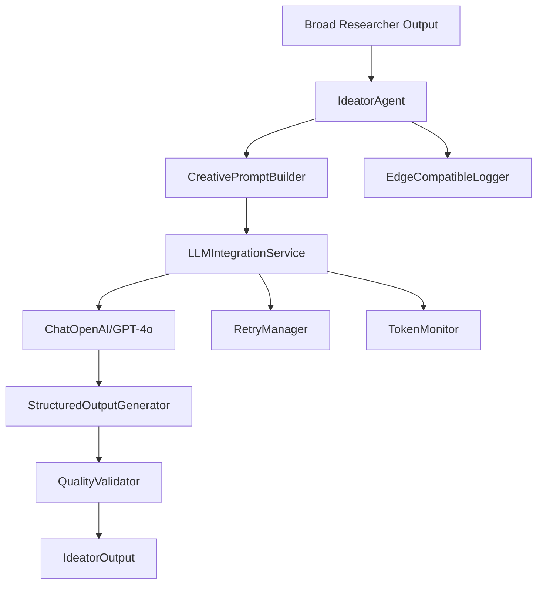
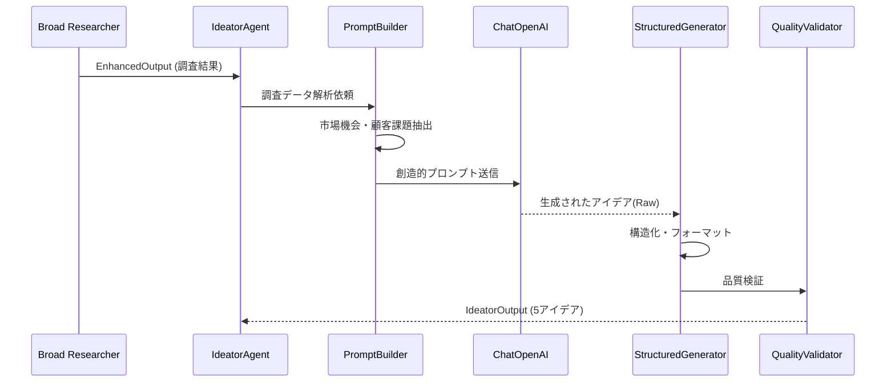
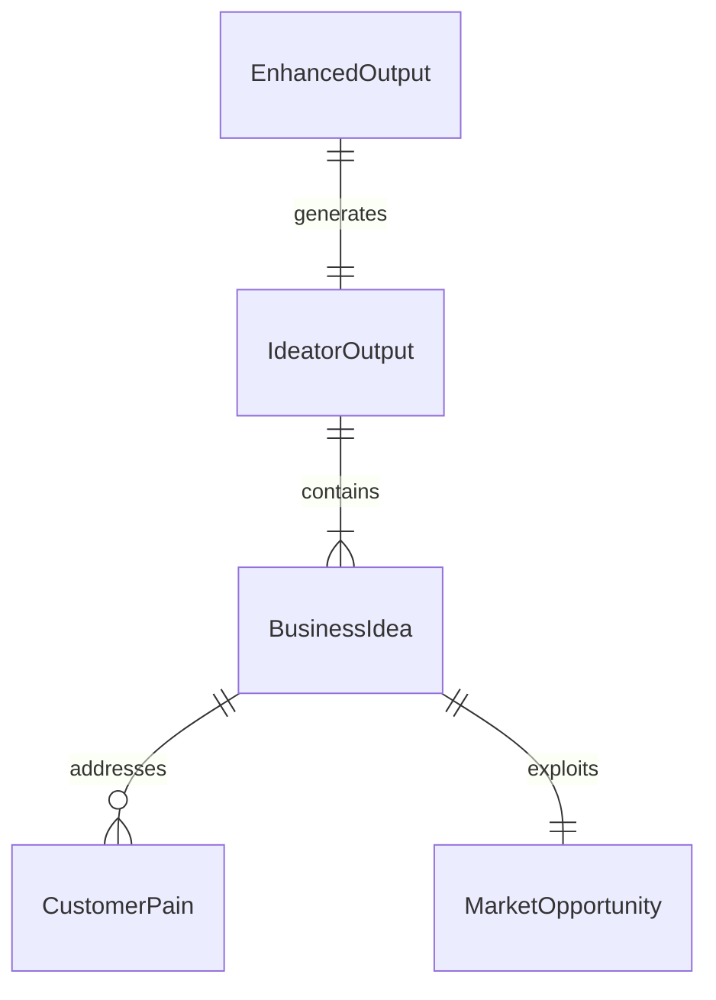
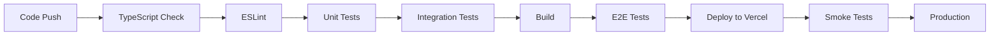

# Technical Design

## Overview
Ideatorエージェントは、Broad Researcherが収集した市場調査データを基に、革新的なビジネスアイデアを5つ生成する専門エージェントです。市場トレンドと顧客ニーズのみに基づいて純粋にビジネス機会を探索し、営業利益10億円規模の実現可能性を持つ具体的な提案を構成します。LangChain/OpenAIを活用し、創造性と一貫性のバランスを取りながら、構造化された出力を生成します。

## Requirements Mapping

### Design Component Traceability
各設計コンポーネントが対応する要件：
- **IdeatorAgent クラス** → REQ-1: ビジネスアイデア生成機能
- **CreativePromptBuilder** → REQ-2: 革新的なビジネスアイデアの創出
- **LLMIntegrationService** → REQ-3: LLM統合と生成品質管理
- **StructuredOutputGenerator** → REQ-4: 出力データ構造とインターフェース
- **ErrorHandler & RetryManager** → REQ-5: パフォーマンスとエラーハンドリング
- **QualityValidator** → REQ-6: テスト可能性とモニタリング
- **EdgeCompatibleLogger** → REQ-7: Edge Functions互換性

### User Story Coverage
- **調査結果からの市場機会特定**: CreativePromptBuilderが調査データから顧客課題・市場ギャップを抽出
- **5つのアイデア生成**: IdeatorAgentが正確に5つのビジネスアイデアを生成・検証
- **構造化された出力**: StructuredOutputGeneratorが必須フィールドを含む標準形式で出力

## Architecture
エージェントは既存のNext.js/TypeScriptアーキテクチャに統合され、Edge Functions環境で動作します。



### Technology Stack
研究結果と要件分析に基づく技術選択：

- **Language**: TypeScript (型安全性と既存コードベースとの統合)
- **AI Framework**: LangChain.js + ChatOpenAI
- **LLM Model**: GPT-4o (gpt-4o)
- **Output Parsing**: Zod + Structured Output
- **Logging**: EdgeLogger (Edge Functions互換)
- **Testing**: Jest + モックLLMレスポンス
- **Caching**: In-memory LRU Cache

### Architecture Decision Rationale
- **LangChain選択理由**: プロンプトテンプレート管理、構造化出力、リトライ機構の標準実装
- **GPT-4o選択理由**: 創造性と論理的一貫性のバランス、日本語対応、低レイテンシ
- **Zod選択理由**: TypeScript統合、ランタイムバリデーション、既存プロジェクトでの採用実績
- **Edge Functions対応**: fs依存なし、ステートレス設計、メモリベースの処理

## Data Flow
アイデア生成プロセスのデータフロー：

### Primary User Flows



## Components and Interfaces

### Backend Services & Method Signatures

```typescript
// lib/agents/ideator/ideator-agent.ts
class IdeatorAgent extends BaseAgent {
    async generateIdeas(researchData: EnhancedOutput): Promise<IdeatorOutput>  // 5つのアイデア生成
    async validateOutput(ideas: BusinessIdea[]): Promise<ValidationResult>     // 出力検証
    protected buildPrompt(data: EnhancedOutput): string                       // プロンプト構築
}

// lib/agents/ideator/creative-prompt-builder.ts
class CreativePromptBuilder {
    buildIdeationPrompt(research: EnhancedOutput): ChatPromptTemplate        // 創造的プロンプト生成
    extractOpportunities(data: EnhancedOutput): MarketOpportunity[]          // 市場機会抽出
    identifyCustomerPains(data: EnhancedOutput): CustomerPain[]              // 顧客課題特定
}

// lib/agents/ideator/llm-integration-service.ts
class LLMIntegrationService {
    async invokeWithRetry(prompt: string, config: LLMConfig): Promise<string> // リトライ付き実行
    async invokeStructured<T>(prompt: string, schema: z.ZodSchema<T>): Promise<T> // 構造化出力
    trackTokenUsage(metadata: UsageMetadata): void                           // トークン使用量記録
}

// lib/agents/ideator/structured-output-generator.ts
class StructuredOutputGenerator {
    parseRawOutput(raw: string): BusinessIdea[]                              // Raw出力パース
    ensureExactCount(ideas: BusinessIdea[], count: number): BusinessIdea[]   // 正確な数を保証
    formatOutput(ideas: BusinessIdea[]): IdeatorOutput                       // 最終形式生成
}
```

### Frontend Components
該当なし（バックエンドエージェントのみ）

### API Endpoints

| Method | Route | Purpose | Auth | Status Codes |
|--------|-------|---------|------|--------------|
| POST   | /api/agents/ideator | アイデア生成実行 | Required | 200, 400, 401, 500 |
| GET    | /api/agents/ideator/status | 生成ステータス確認 | Required | 200, 401, 404 |

## Data Models

### Domain Entities
1. **BusinessIdea**: 個別のビジネスアイデア情報
2. **MarketOpportunity**: 市場機会の詳細分析
3. **CustomerPain**: 顧客の課題・ペインポイント
4. **IdeatorOutput**: エージェントの最終出力

### Entity Relationships


### Data Model Definitions

```typescript
// lib/types/ideator.ts
interface BusinessIdea {
  id: string;
  title: string;                          // 30文字以内のタイトル
  description: string;                     // 200文字程度の概要
  targetCustomers: string[];               // 想定顧客セグメント
  customerPains: string[];                 // 解決する顧客課題
  valueProposition: string;                // 提供価値
  revenueModel: string;                    // 収益構造・ビジネスモデル
  estimatedRevenue: number;                // 推定営業利益（円）
  implementationDifficulty: 'low' | 'medium' | 'high';  // 実装難易度
  marketOpportunity: string;               // 市場機会の説明
}

interface IdeatorOutput {
  sessionId: string;
  ideas: BusinessIdea[];                   // 正確に5つのアイデア
  metadata: {
    generatedAt: Date;
    modelUsed: string;
    tokensUsed: number;
    processingTimeMs: number;
    researchDataId: string;
  };
  qualityMetrics: {
    structureCompleteness: number;        // 構造完全性スコア (0-100)
    contentConsistency: number;           // 内容一貫性スコア (0-100)
    marketClarity: number;                // 市場機会明確性スコア (0-100)
  };
}

interface MarketOpportunity {
  id: string;
  description: string;
  marketSize: number;                     // 市場規模（円）
  growthRate: number;                     // 成長率（%）
  unmetNeeds: string[];                   // 未解決ニーズ
  competitiveGaps: string[];              // 競合の隙間
}

interface LLMConfig {
  model: string;
  temperature: number;
  maxTokens: number;
  topP: number;
  presencePenalty: number;
  frequencyPenalty: number;
}
```

### Database Schema
```sql
-- ideator_outputs table
CREATE TABLE ideator_outputs (
    id UUID PRIMARY KEY DEFAULT gen_random_uuid(),
    session_id UUID REFERENCES ideation_sessions(id),
    research_data_id UUID NOT NULL,
    ideas JSONB NOT NULL,
    metadata JSONB NOT NULL,
    quality_metrics JSONB,
    created_at TIMESTAMPTZ DEFAULT NOW()
);

-- ideator_ideas table (個別アイデア管理用)
CREATE TABLE ideator_ideas (
    id UUID PRIMARY KEY DEFAULT gen_random_uuid(),
    output_id UUID REFERENCES ideator_outputs(id),
    title TEXT NOT NULL,
    description TEXT NOT NULL,
    target_customers TEXT[],
    customer_pains TEXT[],
    value_proposition TEXT,
    revenue_model TEXT,
    estimated_revenue BIGINT,
    implementation_difficulty TEXT CHECK (implementation_difficulty IN ('low', 'medium', 'high')),
    market_opportunity TEXT,
    created_at TIMESTAMPTZ DEFAULT NOW()
);
```

### Migration Strategy
- 新規テーブル追加のため後方互換性問題なし
- インデックス: session_id, created_at に複合インデックス
- JSONBフィールドにGINインデックスで検索性能向上

## Error Handling

```typescript
// lib/agents/ideator/errors.ts
export class IdeatorError extends Error {
  constructor(
    message: string,
    public code: IdeatorErrorCode,
    public details?: any
  ) {
    super(message);
    this.name = 'IdeatorError';
  }
}

export enum IdeatorErrorCode {
  INSUFFICIENT_INPUT = 'INSUFFICIENT_INPUT',
  LLM_GENERATION_FAILED = 'LLM_GENERATION_FAILED',
  INVALID_OUTPUT_FORMAT = 'INVALID_OUTPUT_FORMAT',
  IDEA_COUNT_MISMATCH = 'IDEA_COUNT_MISMATCH',
  QUALITY_THRESHOLD_NOT_MET = 'QUALITY_THRESHOLD_NOT_MET',
  TOKEN_LIMIT_EXCEEDED = 'TOKEN_LIMIT_EXCEEDED'
}

// エラーハンドリング戦略
class ErrorHandler {
  async handleWithRetry<T>(
    operation: () => Promise<T>,
    maxRetries: number = 3
  ): Promise<T> {
    let lastError: Error;
    
    for (let i = 0; i < maxRetries; i++) {
      try {
        return await operation();
      } catch (error) {
        lastError = error;
        await this.exponentialBackoff(i);
        
        if (this.isNonRetryableError(error)) {
          throw error;
        }
      }
    }
    
    throw new IdeatorError(
      `Operation failed after ${maxRetries} retries`,
      IdeatorErrorCode.LLM_GENERATION_FAILED,
      { originalError: lastError }
    );
  }
}
```

## Security Considerations

### Authentication & Authorization
- JWT認証によるAPIエンドポイント保護
- セッションベースのアクセス制御
- ユーザーごとのレート制限

### Data Protection
- 入力データのサニタイゼーション
- プロンプトインジェクション対策
- 生成内容の有害コンテンツフィルタリング

### Security Best Practices
- API キーの環境変数管理
- Edge Functions でのステートレス実行
- ログでの機密情報マスキング
- CORS設定による不正アクセス防止

## Performance & Scalability

### Performance Targets
| Metric | Target | Measurement |
|--------|--------|-------------|
| アイデア生成時間 (p95) | < 30秒 | 5アイデア生成完了まで |
| アイデア生成時間 (p99) | < 60秒 | 5アイデア生成完了まで |
| LLM呼び出し成功率 | > 95% | リトライ含む |
| メモリ使用量 | < 512MB | Edge Functions制限内 |
| 同時実行数 | > 50 | 並行生成セッション |

### Caching Strategy
- **プロンプトテンプレート**: メモリ内キャッシュ
- **市場機会分析**: 1時間TTLでキャッシュ
- **LLMレスポンス**: セッション内での重複回避

### Scalability Approach
- Edge Functions による自動スケーリング
- ステートレス設計による水平展開
- 非同期処理による並行実行
- トークン使用量モニタリングによるコスト管理

## Testing Strategy

### Test Coverage Requirements
- **Unit Tests**: ≥90% コードカバレッジ
- **Integration Tests**: Broad Researcherとの連携テスト
- **E2E Tests**: 完全なアイデア生成フロー
- **Performance Tests**: 並行実行負荷テスト

### Testing Approach

1. **Unit Testing**
```typescript
// __tests__/agents/ideator/ideator-agent.test.ts
describe('IdeatorAgent', () => {
  it('should generate exactly 5 business ideas', async () => {
    const mockResearch = createMockEnhancedOutput();
    const agent = new IdeatorAgent({ model: 'mock' });
    const result = await agent.generateIdeas(mockResearch);
    expect(result.ideas).toHaveLength(5);
  });
  
  it('should handle insufficient input gracefully', async () => {
    const emptyResearch = {} as EnhancedOutput;
    const agent = new IdeatorAgent();
    await expect(agent.generateIdeas(emptyResearch))
      .rejects.toThrow(IdeatorErrorCode.INSUFFICIENT_INPUT);
  });
});
```

2. **Integration Testing**
```typescript
describe('Ideator Integration', () => {
  it('should process Broad Researcher output', async () => {
    const researcher = new BroadResearcherAgent();
    const ideator = new IdeatorAgent();
    
    const research = await researcher.search('sustainable packaging');
    const ideas = await ideator.generateIdeas(research);
    
    expect(ideas.ideas).toHaveLength(5);
    ideas.ideas.forEach(idea => {
      expect(idea.marketOpportunity).toBeTruthy();
      expect(idea.estimatedRevenue).toBeGreaterThan(1_000_000_000);
    });
  });
});
```

3. **End-to-End Testing**
```typescript
describe('Ideation Flow E2E', () => {
  it('should complete full ideation cycle', async () => {
    const response = await request(app)
      .post('/api/agents/ideator')
      .send({ researchDataId: 'test-research-id' })
      .expect(200);
    
    expect(response.body.ideas).toHaveLength(5);
    expect(response.body.metadata.tokensUsed).toBeLessThan(10000);
  });
});
```

4. **Performance Testing**
```typescript
describe('Ideator Performance', () => {
  it('should handle concurrent requests', async () => {
    const promises = Array.from({ length: 10 }, () => 
      agent.generateIdeas(mockData)
    );
    
    const results = await Promise.all(promises);
    results.forEach(result => {
      expect(result.metadata.processingTimeMs).toBeLessThan(60000);
    });
  });
});
```

### CI/CD Pipeline
