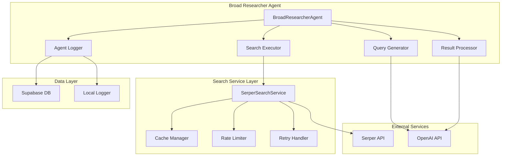
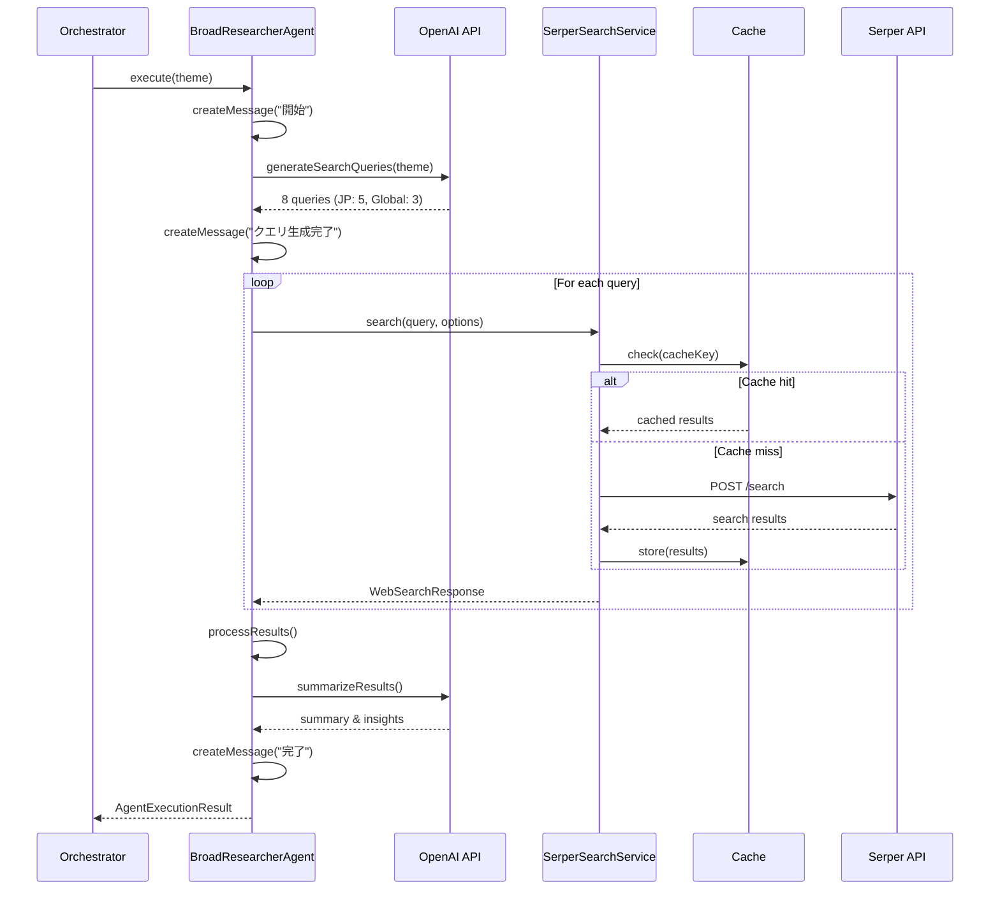
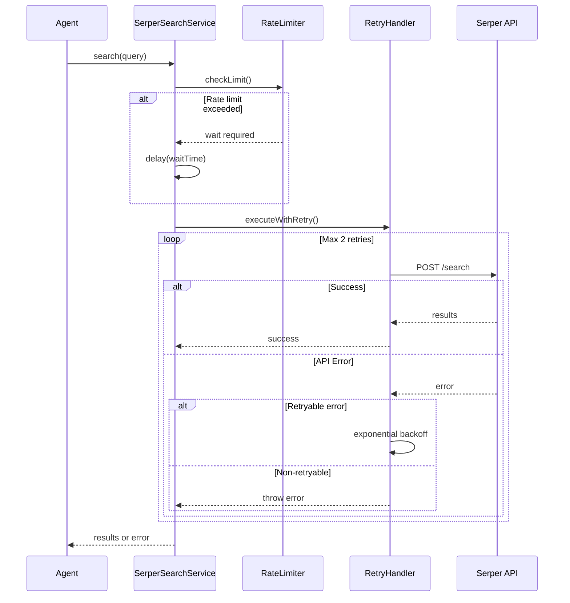
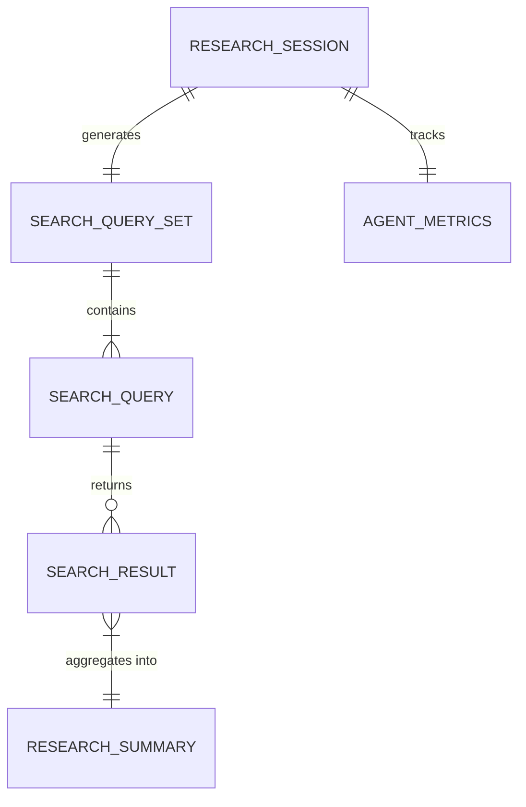
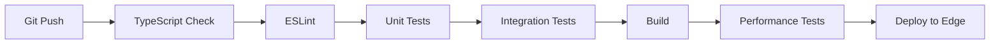

# Technical Design

## Overview
Broad Researcherエージェントは、autonomous-ideation-agentシステムの最初のエージェントとして、与えられたテーマに基づいて日本市場と海外先端事例の包括的な市場調査を実行します。Serper APIを活用したWeb検索と、LLMによる検索クエリ生成・結果要約を組み合わせ、後続のエージェントが利用しやすい構造化データを生成します。

## Requirements Mapping

### Design Component Traceability
各設計コンポーネントが対応する要件：
- **SerperSearchService** → REQ-1: Web検索サービスの実装
- **BroadResearcherAgent** → REQ-2: Broad Researcherエージェントの実装
- **SearchResultProcessor** → REQ-3: 検索結果の処理と統合
- **AgentMonitoring** → REQ-4: エージェントのテストとモニタリング
- **ConfigurationManager** → REQ-5: 設定と環境管理
- **BaseAgent継承** → REQ-6: 既存システムとの統合

### User Story Coverage
- **エージェントシステムのWeb検索実行**: SerperSearchServiceが日本/海外の検索を処理
- **包括的な市場調査の自動実行**: BroadResearcherAgentが8つの検索クエリを生成・実行
- **構造化データの提供**: SearchResultProcessorが後続エージェント用にデータを整形
- **品質と性能の確保**: 包括的なテストとモニタリング実装
- **柔軟な設定管理**: 環境変数による設定とエラーハンドリング
- **シームレスな統合**: BaseAgent準拠の実装とagent_logsへの記録

## Architecture



### Technology Stack

- **Language**: TypeScript 5.9+
- **Runtime**: Next.js 15 Edge Functions
- **AI Framework**: LangChain + OpenAI SDK
- **Web Search**: Serper API
- **Caching**: In-memory Map (将来的にRedis/Upstash)
- **Validation**: Zod
- **Testing**: Jest + Testing Library
- **Monitoring**: Custom metrics + console logging

### Architecture Decision Rationale

- **Why TypeScript**: 既存プロジェクトとの一貫性、型安全性、優れたIDEサポート
- **Why Edge Functions**: 低レイテンシ、グローバル分散、自動スケーリング、コスト効率
- **Why Serper API**: シンプルなREST API、日本語対応、豊富な検索オプション、安定性
- **Why In-memory Cache**: 初期実装のシンプルさ、Edge Function互換、将来の拡張性
- **Why LangChain**: エージェント実装の標準化、豊富なツール、コミュニティサポート

## Data Flow

### Primary User Flows

#### 1. 検索クエリ生成と実行フロー


#### 2. エラーハンドリングとリトライフロー


## Components and Interfaces

### Backend Services & Method Signatures

#### SerperSearchService
```typescript
class SerperSearchService implements WebSearchService {
  constructor(config: SearchServiceConfig)
  
  async search(query: WebSearchQuery): Promise<WebSearchResponse>     // 検索実行
  async searchWithRetry(query: string, options?: SearchOptions): Promise<WebSearchResult[]>  // リトライ付き検索
  async batchSearch(queries: WebSearchQuery[]): Promise<WebSearchResponse[]>  // バッチ検索
  clearCache(): void                                                  // キャッシュクリア
  validateApiKey(): Promise<boolean>                                 // APIキー検証
}

interface SearchServiceConfig {
  apiKey: string
  timeout?: number        // デフォルト: 5000ms
  cacheTTL?: number      // デフォルト: 3600000ms (1時間)
  maxRetries?: number    // デフォルト: 2
}
```

#### BroadResearcherAgent
```typescript
class BroadResearcherAgent extends BaseAgent {
  constructor(
    context: BaseAgentContext,
    searchService: WebSearchService,
    llm: BaseChatModel
  )
  
  async execute(input: ResearcherInput): Promise<AgentExecutionResult>  // メイン実行
  getAgentName(): 'researcher'                                          // エージェント名
  
  private async generateSearchQueries(theme: string): Promise<SearchQuerySet>  // クエリ生成
  private async executeSearches(queries: SearchQuerySet): Promise<SearchResults>  // 検索実行
  private async processResults(results: SearchResults): Promise<ProcessedResearch>  // 結果処理
  private async summarizeResults(processed: ProcessedResearch): Promise<ResearchSummary>  // 要約生成
}

interface ResearcherInput {
  theme: string           // 調査テーマ
  sessionId: string      // セッションID
  constraints?: {
    maxResults?: number  // 最大結果数
    regions?: string[]   // 対象地域
  }
}
```

#### SearchResultProcessor
```typescript
class SearchResultProcessor {
  removeDuplicates(results: WebSearchResult[]): WebSearchResult[]     // 重複除去
  extractKeyInsights(results: WebSearchResult[]): KeyInsight[]        // インサイト抽出
  categorizeByRegion(results: WebSearchResult[]): CategorizedResults  // 地域別分類
  analyzeApplicability(globalResults: WebSearchResult[]): ApplicabilityAnalysis  // 適用可能性分析
}
```

#### RateLimiter
```typescript
class RateLimiter {
  constructor(maxRequests: number, windowMs: number)
  
  async checkLimit(): Promise<boolean>      // レート制限チェック
  async waitIfNeeded(): Promise<void>       // 必要に応じて待機
  reset(): void                             // カウンターリセット
}
```

### Frontend Components
このエージェントはバックエンドサービスのため、フロントエンドコンポーネントはありません。

### API Endpoints
このエージェントは内部サービスとして動作し、直接的なAPIエンドポイントは提供しません。LangGraphオーケストレーターから呼び出されます。

## Data Models

### Domain Entities
1. **SearchQuery**: 検索クエリとオプション
2. **SearchResult**: 個別の検索結果
3. **ResearchSummary**: 統合された調査サマリー
4. **AgentMetrics**: エージェント実行メトリクス

### Entity Relationships


### Data Model Definitions

```typescript
// 検索クエリセット
interface SearchQuerySet {
  japanese: SearchQuery[]      // 日本市場向けクエリ（5つ）
  global: SearchQuery[]        // 海外先端事例向けクエリ（3つ）
  generatedAt: Date
}

// 個別検索クエリ
interface SearchQuery {
  query: string
  purpose: 'market_size' | 'competitors' | 'trends' | 'regulations' | 'needs' | 
           'startups' | 'technology' | 'best_practices'
  region: 'jp' | 'global'
  options: {
    gl: string  // 地域コード
    hl: string  // 言語コード
    num: number // 結果数
  }
}

// 検索結果
interface SearchResults {
  japanese: WebSearchResult[]
  global: WebSearchResult[]
  searchTime: number
  totalResults: number
}

// 処理済み研究データ
interface ProcessedResearch {
  theme: string
  queries: SearchQuerySet
  rawResults: SearchResults
  insights: {
    marketSize?: string
    competitors?: string[]
    trends?: string[]
    regulations?: string[]
    customerNeeds?: string[]
  }
  globalInsights: {
    innovations?: string[]
    technologies?: string[]
    bestPractices?: string[]
    applicability?: string  // 日本市場への適用可能性
  }
  sources: {
    japanese: string[]
    global: string[]
  }
}

// 研究サマリー（最終出力）
interface ResearchSummary extends ProcessedResearch {
  summary: string              // LLMによる統合要約
  keyFindings: string[]        // 主要な発見事項
  recommendations?: string[]   // 推奨事項（オプション）
  generatedAt: Date
}

// エージェントメトリクス
interface AgentMetrics {
  executionTime: number        // 実行時間（ms）
  tokensUsed: number          // 使用トークン数
  apiCallsCount: number       // API呼び出し回数
  cacheHitRate: number        // キャッシュヒット率
  errors: ErrorMetric[]       // エラー情報
}
```

### Database Schema
```sql
-- agent_logsテーブルに保存されるデータ構造
-- data列（JSONB）の内容：
{
  "executionId": "uuid",
  "theme": "調査テーマ",
  "queries": {
    "japanese": [...],
    "global": [...]
  },
  "results": {
    "summary": "要約",
    "insights": {...},
    "sources": {...}
  },
  "metrics": {
    "executionTime": 1234,
    "tokensUsed": 567,
    "apiCallsCount": 8
  }
}
```

### Migration Strategy
- エージェント固有のテーブルは作成せず、既存のagent_logsテーブルを活用
- JSONBカラムによる柔軟なスキーマ進化
- 将来的な検索履歴テーブルの追加を考慮した設計

## Error Handling

### エラー分類と処理戦略

#### 1. Serper APIエラー
```typescript
class SerperAPIError extends Error {
  constructor(
    public statusCode: number,
    public message: string,
    public retryable: boolean
  ) {
    super(message)
  }
}

// 処理戦略
- 400番台: 入力検証エラー → 即座に失敗
- 429: レート制限 → 待機後リトライ
- 500番台: サーバーエラー → 指数バックオフでリトライ
- タイムアウト: 5秒 → リトライ可能
```

#### 2. LLMエラー
```typescript
// 処理戦略
- トークン上限: クエリ数を減らして再試行
- APIエラー: 標準的なリトライ戦略
- 無効な応答: デフォルトクエリセットを使用
```

#### 3. キャッシュエラー
```typescript
// 処理戦略
- キャッシュ読み取り失敗: 警告ログ後、APIを直接呼び出し
- キャッシュ書き込み失敗: 警告ログのみ、処理は継続
```

#### 4. データベースエラー
```typescript
// 処理戦略
- agent_logs書き込み失敗: ローカルファイルにフォールバック
- 接続エラー: エラーログ記録、エージェント実行は継続
```

## Security Considerations

### Authentication & Authorization
- Serper APIキーの安全な管理（環境変数）
- APIキーの起動時検証
- エラーメッセージでのAPIキー非表示

### Data Protection
- 検索クエリのサニタイゼーション
- キャッシュデータの適切な有効期限設定
- センシティブな検索結果のフィルタリング

### Security Best Practices
- 環境変数によるシークレット管理
- HTTPSのみでの通信
- レート制限による悪用防止
- 入力検証（Zodスキーマ）
- エラーメッセージの適切な抽象化

## Performance & Scalability

### Performance Targets
| Metric | Target | Measurement |
|--------|--------|-------------|
| クエリ生成時間 | < 2秒 | LLM応答時間 |
| 単一検索時間 | < 500ms | Serper API応答 |
| 全体処理時間 | < 30秒 | 8クエリの並列実行 |
| キャッシュヒット率 | > 30% | 同一テーマの再検索 |
| メモリ使用量 | < 50MB | Edge Function制限内 |

### Caching Strategy
- **インメモリキャッシュ**: Map構造、LRU風の実装
- **キャッシュキー**: `${query}-${gl}-${hl}-${num}`のハッシュ
- **TTL**: 1時間（環境変数で設定可能）
- **最大エントリ数**: 1000件（メモリ制限考慮）

### Scalability Approach
- **並列検索実行**: Promise.allによる8クエリ同時実行
- **レート制限対応**: トークンバケット方式
- **エラー時の部分的成功**: 一部の検索が失敗しても処理継続
- **将来の拡張**: Redis/Upstashへの移行パス

## Testing Strategy

### Test Coverage Requirements
- **Unit Tests**: ≥80% カバレッジ
- **Integration Tests**: Serper API統合、LLM統合
- **E2E Tests**: エージェント全体フロー
- **Performance Tests**: 並列実行、タイムアウト処理

### Testing Approach

#### 1. Unit Testing
```typescript
// SerperSearchService
describe('SerperSearchService', () => {
  it('should return cached results when available')
  it('should handle rate limiting with proper delays')
  it('should retry on retryable errors')
  it('should validate API key on initialization')
})

// BroadResearcherAgent
describe('BroadResearcherAgent', () => {
  it('should generate 8 search queries (5 JP, 3 Global)')
  it('should handle partial search failures')
  it('should create proper agent messages')
  it('should return structured research summary')
})
```

#### 2. Integration Testing
```typescript
// Mock Serper API responses
const mockSerperAPI = setupMockServer({
  '/search': mockSearchResponse
})

// Test with real LLM (limited)
describe('Integration', () => {
  it('should complete full research flow')
  it('should handle API errors gracefully')
})
```

#### 3. End-to-End Testing
```typescript
describe('E2E Research Flow', () => {
  it('should research "スマートシティ" theme')
  it('should handle timeout scenarios')
  it('should log to agent_logs table')
})
```

#### 4. Performance Testing
```typescript
describe('Performance', () => {
  it('should complete 8 searches within 30 seconds')
  it('should maintain memory usage under 50MB')
  it('should achieve >30% cache hit rate')
})
```

### CI/CD Pipeline
