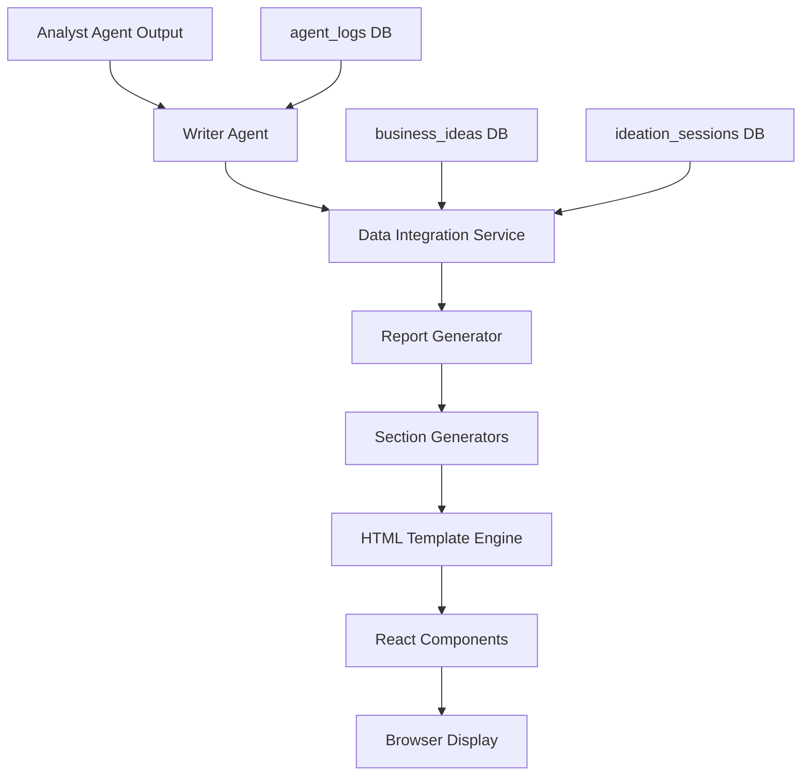
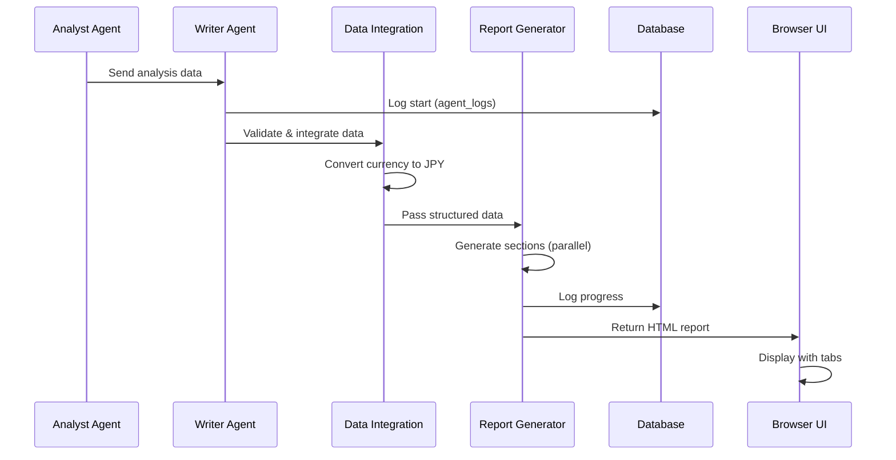
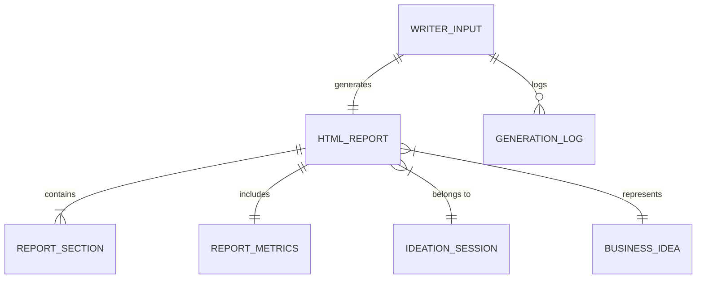
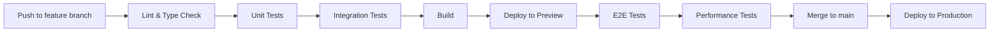

# Technical Design

## Overview
Writerエージェントは、自律型アイディエーションエージェントAIシステムの最終処理を担当する専門エージェントです。Analystエージェントから受け取った詳細な市場分析とビジネス戦略データを、ブラウザ表示に最適化された1ページ完結型のHTMLレポートに変換します。React Server ComponentsとTailwindCSSを活用し、タブ形式のインタラクティブなレポートを5秒以内に生成します。

## Requirements Mapping

### Design Component Traceability
各設計コンポーネントが対応する要件：
- **WriterAgent クラス** → REQ-1: レポート生成機能（自動処理開始、エラーハンドリング）
- **ReportGenerator サービス** → REQ-1.3: 5秒以内の処理完了
- **TabLayout コンポーネント** → REQ-2: HTML形式タブ構造（5つのタブ、レスポンシブ対応）
- **SummarySection** → REQ-3: サマリーセクション生成（300文字以内、円単位表記）
- **BusinessModelSection** → REQ-4: ビジネスモデルセクション（4サブセクション）
- **MarketAnalysisSection** → REQ-5: 市場分析セクション（TAM/PAM/SAM、競合分析）
- **SynergySection** → REQ-6: 三菱地所シナジー分析
- **ValidationPlanSection** → REQ-7: 検証計画セクション（3フェーズ）
- **DataIntegrationService** → REQ-8: データ統合と整合性（円単位統一）
- **PerformanceMonitor** → REQ-9: パフォーマンスと信頼性（95%で5秒以内）

### User Story Coverage
- **エージェントシステム利用者**: WriterAgentが自動起動し、進捗をagent_logsに記録
- **三菱地所新事業担当者**: タブ切り替えUIで効率的な情報アクセス
- **意思決定者**: エグゼクティブサマリーで1分以内の要点把握
- **プロジェクトマネージャー**: 検証計画セクションで具体的アクションプラン確認

## Architecture



### Technology Stack

- **Frontend**: Next.js 15 (App Router) + TypeScript
- **UI Components**: React Server Components + Client Components
- **Styling**: TailwindCSS + CSS Modules
- **Data Processing**: LangChain + Zod validation
- **Database**: Supabase (PostgreSQL)
- **Deployment**: Vercel Edge Functions
- **Testing**: Jest + React Testing Library

### Architecture Decision Rationale

- **Next.js App Router**: 既存システムとの統合、Server Componentsによる高速レンダリング
- **TailwindCSS**: レスポンシブデザインの迅速な実装、既存UIコンポーネントとの一貫性
- **Server Components優先**: 初期表示の高速化、SEO最適化、コスト削減
- **Edge Functions**: 5秒以内のレスポンス要件達成、グローバルな低レイテンシ
- **Zod validation**: 型安全性の確保、ランタイムでのデータ整合性検証

## Data Flow

### Primary Report Generation Flow



## Components and Interfaces

### Backend Services & Method Signatures

```typescript
// Writer Agent Service
class WriterAgent extends BaseAgent {
  async processAnalysisData(data: AnalystOutput): Promise<HTMLReport>
  async validateInput(data: unknown): Promise<ValidatedAnalystData>
  private async logProgress(sessionId: string, message: string): Promise<void>
  private async handleError(error: Error, partialContent?: Partial<HTMLReport>): Promise<void>
}

// Report Generator Service
class ReportGenerator {
  async generateReport(data: ValidatedAnalystData): Promise<HTMLReport>
  private async generateSummary(data: BusinessIdea): Promise<string>
  private async generateBusinessModel(data: BusinessIdea): Promise<BusinessModelContent>
  private async generateMarketAnalysis(data: MarketData): Promise<MarketAnalysisContent>
  private async generateSynergy(data: SynergyData): Promise<SynergyContent>
  private async generateValidationPlan(data: ValidationData): Promise<ValidationPlanContent>
}

// Data Integration Service
class DataIntegrationService {
  async integrateData(sources: DataSource[]): Promise<IntegratedData>
  async validateConsistency(data: IntegratedData): Promise<ValidationResult>
  async convertCurrency(amount: number, from: string): Promise<number> // to JPY
  async formatCurrency(amount: number): Promise<string> // ¥1,000,000 format
}
```

### Frontend Components

| Component Name | Responsibility | Props/State Summary |
|---------------|----------------|-------------------|
| ReportLayout | メインレイアウト、タブ管理 | activeTab, reportData, onTabChange |
| TabNavigation | タブナビゲーション UI | tabs[], activeTab, onTabChange |
| SummaryTab | サマリー表示 | summary, metrics, synergyScore |
| BusinessModelTab | ビジネスモデル表示 | customer, problem, value, revenue |
| MarketAnalysisTab | 市場分析表示 | tam, pam, sam, competitors, trends |
| SynergyTab | 三菱地所シナジー表示 | score, breakdown, initiatives |
| ValidationPlanTab | 検証計画表示 | phases[], timeline, kpis |
| MetricCard | 指標カード表示 | label, value, unit, trend |
| CompetitorTable | 競合分析テーブル | competitors[], columns |
| PhaseTimeline | フェーズタイムライン | phases[], currentPhase |

### API Endpoints

| Method | Route | Purpose | Auth | Status Codes |
|--------|-------|---------|------|--------------|
| POST | /api/agents/writer | レポート生成開始 | Required | 201, 400, 401, 500 |
| GET | /api/reports/:id | レポート取得 | Required | 200, 401, 404 |
| GET | /api/reports/:id/status | 生成ステータス確認 | Required | 200, 401, 404 |
| POST | /api/reports/:id/regenerate | レポート再生成 | Required | 201, 401, 404, 500 |

## Data Models

### Domain Entities
1. **WriterInput**: Analystエージェントからの入力データ
2. **HTMLReport**: 生成されたHTMLレポート
3. **ReportSection**: 各タブセクションのコンテンツ
4. **ReportMetrics**: ビジネス指標とスコア
5. **GenerationLog**: 生成プロセスのログ

### Entity Relationships


### Data Model Definitions

```typescript
// Writer Input Interface
interface WriterInput {
  sessionId: string;
  ideaId: string;
  analystData: {
    businessIdea: BusinessIdea;
    marketAnalysis: MarketAnalysis;
    synergyAnalysis: SynergyAnalysis;
    validationPlan: ValidationPlan;
  };
  metadata: {
    generatedAt: Date;
    version: string;
  };
}

// HTML Report Interface
interface HTMLReport {
  id: string;
  sessionId: string;
  ideaId: string;
  title: string;
  htmlContent: string;
  sections: ReportSection[];
  metrics: ReportMetrics;
  generatedAt: Date;
  generationTime: number; // milliseconds
}

// Report Section Interface
interface ReportSection {
  id: string;
  type: 'summary' | 'business_model' | 'market' | 'synergy' | 'validation';
  title: string;
  content: string; // HTML string
  order: number;
}

// Report Metrics Interface
interface ReportMetrics {
  tam: number; // 円
  pam: number; // 円
  sam: number; // 円
  revenueProjection3Y: number; // 円
  synergyScore: number; // 0-100
  implementationDifficulty: 'low' | 'medium' | 'high';
  timeToMarket: number; // months
}
```

### Database Schema Updates
```sql
-- HTML Reports Table
CREATE TABLE html_reports (
  id UUID PRIMARY KEY DEFAULT gen_random_uuid(),
  session_id UUID REFERENCES ideation_sessions(id),
  idea_id UUID REFERENCES business_ideas(id),
  title TEXT NOT NULL,
  html_content TEXT NOT NULL,
  sections JSONB NOT NULL,
  metrics JSONB NOT NULL,
  generated_at TIMESTAMPTZ DEFAULT NOW(),
  generation_time_ms INTEGER,
  created_at TIMESTAMPTZ DEFAULT NOW(),
  updated_at TIMESTAMPTZ DEFAULT NOW()
);

-- Generation Logs Extension for Writer
ALTER TABLE agent_logs 
ADD COLUMN IF NOT EXISTS generation_phase TEXT,
ADD COLUMN IF NOT EXISTS completion_percentage INTEGER;
```

## Error Handling

### Error Types and Strategies
```typescript
enum WriterErrorType {
  INVALID_INPUT = 'INVALID_INPUT',
  MISSING_REQUIRED_DATA = 'MISSING_REQUIRED_DATA',
  GENERATION_TIMEOUT = 'GENERATION_TIMEOUT',
  TEMPLATE_ERROR = 'TEMPLATE_ERROR',
  DATABASE_ERROR = 'DATABASE_ERROR'
}

class WriterErrorHandler {
  async handle(error: WriterError): Promise<ErrorResponse> {
    switch(error.type) {
      case WriterErrorType.INVALID_INPUT:
        // Log詳細、部分データ保存、エラーレスポンス返却
        await this.savePartialContent(error.partialData);
        return { status: 400, message: 'Invalid input data format' };
      
      case WriterErrorType.GENERATION_TIMEOUT:
        // 部分生成コンテンツ保存、リトライキューに追加
        await this.queueForRetry(error.context);
        return { status: 504, message: 'Generation timeout, queued for retry' };
    }
  }
}
```

## Security Considerations

### Input Validation
- Zodスキーマによる厳密な入力検証
- XSS対策: DOMPurifyによるHTMLサニタイゼーション
- SQLインジェクション防止: Parameterized queries
- レート制限: 1ユーザー10リクエスト/分

### Data Protection
- 機密データマスキング（収益予測の詳細など）
- HTTPSによる通信暗号化
- Row Level Security (RLS)による権限管理
- セッションベースのアクセス制御

## Performance & Scalability

### Performance Targets
| Metric | Target | Measurement |
|--------|--------|-------------|
| Report Generation Time (p95) | < 5秒 | エンドツーエンド |
| Report Generation Time (p99) | < 8秒 | エンドツーエンド |
| Tab Switch Response | < 100ms | クライアントサイド |
| Concurrent Generation | 10件 | 同時処理数 |
| HTML Size | < 500KB | 圧縮後 |

### Optimization Strategies
- **並列処理**: 各セクション生成を並列実行
- **キャッシング**: 
  - React Server Component キャッシュ
  - Vercel Edge Cache（静的アセット）
  - Database query結果キャッシュ（1時間）
- **Progressive Enhancement**: 
  - Critical CSSのインライン化
  - 非同期コンポーネントローディング
  - Lazy loading for heavy visualizations

### Scalability Approach
- Edge Functionsによる自動スケーリング
- Database connection pooling (最大20接続)
- Queue-based処理（高負荷時）
- CDN配信（静的リソース）

## Testing Strategy

### Test Coverage Requirements
- **Unit Tests**: ≥85% (ビジネスロジック)
- **Integration Tests**: 全APIエンドポイント
- **E2E Tests**: レポート生成フロー全体
- **Performance Tests**: 5秒以内の生成確認

### Testing Approach

```typescript
// Unit Test Example
describe('ReportGenerator', () => {
  test('should generate summary within 300 characters', async () => {
    const generator = new ReportGenerator();
    const summary = await generator.generateSummary(mockBusinessIdea);
    expect(summary.length).toBeLessThanOrEqual(300);
  });

  test('should format currency in JPY', async () => {
    const formatted = formatCurrency(1000000);
    expect(formatted).toBe('¥1,000,000');
  });
});

// Integration Test Example
describe('Writer API', () => {
  test('should generate report within 5 seconds', async () => {
    const start = Date.now();
    const response = await request(app)
      .post('/api/agents/writer')
      .send(mockAnalystData);
    const duration = Date.now() - start;
    
    expect(response.status).toBe(201);
    expect(duration).toBeLessThan(5000);
  });
});
```

### CI/CD Pipeline
