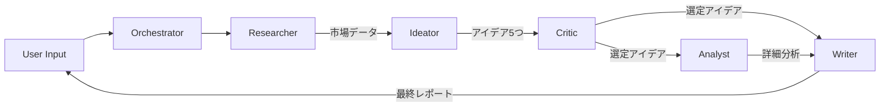

# エージェント依存関係マップ

## 🎯 全体アーキテクチャ

### システム全体フロー
```
User Input → Frontend → API Gateway → Orchestrator → Agents → Response
```

## 🔄 エージェント間の依存関係

### 1. データフロー依存関係



### 2. 機能依存関係

| エージェント | 依存先 | 依存内容 | インターフェース |
|------------|--------|---------|---------------|
| **Orchestrator** | - | なし | StateGraph API |
| **Researcher** | Serper API | Web検索 | REST API |
| **Ideator** | Researcher | 市場調査データ | JSON |
| **Critic** | Ideator | ビジネスアイデア | JSON Array |
| **Analyst** | Critic | 選定されたアイデア | JSON |
| **Writer** | Critic, Analyst | 評価結果と分析 | JSON |

### 3. 技術スタック依存関係

```yaml
共通依存:
  - LangChain Core: v0.3.70
  - OpenAI SDK: v5.12.0
  - TypeScript: v5.9.2

個別依存:
  Orchestrator:
    - LangGraph: v0.4.4
    - State Management
    
  Researcher:
    - Serper API Client
    - Web Scraping Tools
    
  Ideator:
    - GPT-4o Model
    - Prompt Templates
    
  Critic:
    - Evaluation Framework
    - Scoring Algorithm
    
  Analyst:
    - Data Analysis Tools
    - Statistical Libraries
    
  Writer:
    - Document Templates
    - Markdown Processor
```

## 📊 実行順序と並列処理

### シーケンシャル実行（通常フロー）
```
1. Researcher (15-30秒)
   ↓
2. Ideator (10-20秒)
   ↓
3. Critic (5-10秒)
   ↓
4. Analyst & Writer (並列: 20-30秒)
   ↓
5. 結果統合 (2-5秒)

総実行時間: 約60-90秒
```

### 並列実行最適化
```
Phase 1: Research
  - Researcher (複数クエリを並列実行)
  
Phase 2: Generation
  - Ideator (5つのアイデアを並列生成)
  
Phase 3: Evaluation & Analysis
  - Critic → [Analyst, Writer] (並列)
```

## 🔗 API依存関係

### 外部API依存
```typescript
interface ExternalAPIs {
  openai: {
    endpoint: 'https://api.openai.com/v1',
    models: ['gpt-4o', 'gpt-4o-mini'],
    rateLimit: '10000 RPD'
  },
  serper: {
    endpoint: 'https://google.serper.dev',
    rateLimit: '1000 searches/month'
  },
  supabase: {
    endpoint: process.env.NEXT_PUBLIC_SUPABASE_URL,
    services: ['auth', 'database', 'storage']
  }
}
```

### 内部API依存
```typescript
interface InternalAPIs {
  '/api/agents/execute': {
    depends: ['all-agents'],
    method: 'POST'
  },
  '/api/agents/researcher/run': {
    depends: ['serper-api'],
    method: 'POST'
  },
  '/api/agents/ideator/run': {
    depends: ['researcher-output'],
    method: 'POST'
  },
  '/api/agents/critic/run': {
    depends: ['ideator-output'],
    method: 'POST'
  },
  '/api/agents/analyst/run': {
    depends: ['critic-output'],
    method: 'POST'
  },
  '/api/agents/writer/run': {
    depends: ['critic-output', 'analyst-output'],
    method: 'POST'
  }
}
```

## 🏗️ インフラ依存関係

### デプロイメント依存
```yaml
Production:
  Vercel:
    - Next.js App
    - API Routes
    - Edge Functions
    
  Supabase:
    - PostgreSQL Database
    - Authentication
    - Realtime Subscriptions
    
  External:
    - OpenAI API
    - Serper API
```

### 環境変数依存
```bash
# 必須環境変数（依存関係順）
NEXT_PUBLIC_SUPABASE_URL      # 1. Database
NEXT_PUBLIC_SUPABASE_ANON_KEY  # 2. Auth
SUPABASE_SERVICE_ROLE_KEY      # 3. Admin
OPENAI_API_KEY                 # 4. AI Models
SERPER_API_KEY                 # 5. Search
```

## 🔍 エラー伝播と対処

### エラー伝播パス
```
Serper API Error
  → Researcher Failure
    → Ideator Cannot Proceed
      → Entire Workflow Stops
```

### フォールバック戦略
```typescript
const fallbackStrategies = {
  researcher: {
    primary: 'serper-api',
    fallback: 'mock-data',
    cache: 'previous-results'
  },
  ideator: {
    primary: 'gpt-4o',
    fallback: 'gpt-4o-mini',
    retry: 3
  },
  critic: {
    primary: 'ai-evaluation',
    fallback: 'rule-based',
    threshold: 0.7
  }
};
```

## 📈 パフォーマンス依存関係

### ボトルネック分析
```
Critical Path:
Researcher (30s) → Ideator (20s) → Critic (10s) → Writer (30s)
= 90秒（最小）

並列化可能:
- Researcher: 複数検索クエリ
- Analyst & Writer: 独立実行
```

### 最適化ポイント
1. **キャッシング**: Researcher結果を24時間キャッシュ
2. **並列処理**: Analyst と Writer を同時実行
3. **早期終了**: Critic で閾値未満は即終了
4. **ストリーミング**: Writer の段階的出力

## 🚨 循環依存の防止

### 禁止される依存関係
```
❌ Writer → Ideator （循環）
❌ Critic → Researcher （逆流）
❌ Analyst → Ideator （スキップ）
```

### 依存関係ルール
1. **単方向フロー**: 上流から下流への一方向のみ
2. **レイヤー分離**: 同一レイヤー内での依存禁止
3. **インターフェース統一**: JSON形式での通信

## 📊 依存関係マトリクス

|  | Orch | Res | Idea | Crit | Anal | Writ |
|---|:---:|:---:|:---:|:---:|:---:|:---:|
| **Orchestrator** | - | ✓ | ✓ | ✓ | ✓ | ✓ |
| **Researcher** | - | - | → | - | - | - |
| **Ideator** | - | ← | - | → | - | - |
| **Critic** | - | - | ← | - | → | → |
| **Analyst** | - | - | - | ← | - | → |
| **Writer** | - | - | - | ← | ← | - |

凡例:
- ✓: 制御
- →: データ提供
- ←: データ受信
- -: 依存なし

## 🔄 更新管理

### バージョン互換性
```typescript
interface VersionCompatibility {
  'researcher@1.2.0': ['ideator@1.0+'],
  'ideator@1.1.0': ['critic@1.0+'],
  'critic@1.0.0': ['analyst@1.0+', 'writer@1.0+'],
  'orchestrator@1.0.0': ['all-agents@1.0+']
}
```

### 依存関係更新手順
1. 影響分析実施
2. 下流エージェントから更新
3. インターフェーステスト
4. 統合テスト
5. 本番デプロイ

---

最終更新: 2025-01-17
次回レビュー: 2025-02-01